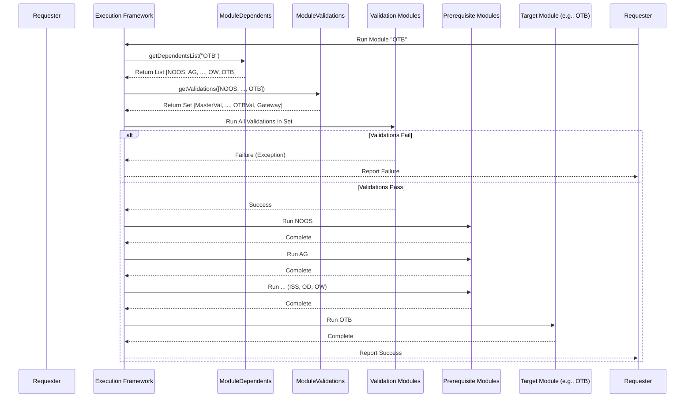

# Chapter 62: Module Dependencies & Validation Mapping

Welcome back! In the [previous chapter](61_abstract_module_group_.md), we saw how complex processes like OTB Calculation or Distribution are organized using **Abstract Module Groups**, which define a sequence of sub-modules to run. This helps manage workflows like OTB (`OtbGroupModule`) or NOOS (`NoosGroupModule`).

But now, think about the bigger picture. We have many different high-level modules or groups (NOOS, ISS, OD, OW, OTB, Distribution, etc.). Does the order in which we run these *matter*?
*   Can we calculate the OTB budget *before* we've calculated the Optimum Width (OW)? (Probably not, OTB needs OW results).
*   Can we calculate the Optimum Depth (OD) *before* identifying which sizes are important via Ideal Size Set (ISS)? (No, OD often depends on ISS).

Also, before running a complex calculation like OTB, shouldn't we check if the input data (like sales history or product master data) is valid and makes sense? Running a module with bad input data could lead to errors or nonsensical results.

## What Problem Do These Utilities Solve?

Imagine you have a set of major projects for building a house: Lay Foundation, Build Walls, Install Roof, Install Plumbing, Install Electrical.
1.  **Order Matters:** You absolutely *cannot* install the roof before building the walls! There's a required sequence or **dependency**.
2.  **Checks Matter:** Before building the walls, you need to check if the foundation is level and properly cured (a **validation**). Before installing plumbing, you need to check if you have the right pipes and fittings (another **validation**).

`irisx-algo` has many complex modules that depend on each other, and they rely on good quality input data. We need a system to manage:
*   **Execution Order:** Defining which modules must be completed *before* another module can run.
*   **Data Quality Checks:** Specifying which validation checks should be performed *before* a specific module runs to ensure data integrity.

Manually keeping track of this complex web of dependencies and required checks would be very difficult and error-prone.

The **Module Dependencies & Validation Mapping** utilities solve this. They act like the master blueprint and inspection checklist for the entire `irisx-algo` workflow:

*   **`ModuleDependents`:** Specifies the required **prerequisite modules** for each major calculation module. (e.g., "To run OTB, you must first run NOOS, AG, ISS, OD, and OW.")
*   **`ModuleValidations`:** Specifies the required **validation checks** that must pass before a specific module can run. (e.g., "Before running OTB, you must run the `MASTER_INPUT_VALIDATION` and `OTB_INPUT_VALIDATION` checks.")

These utilities provide a central, defined place to manage the overall execution flow and data quality requirements.

## Core Concepts: The Blueprint and the Checklist

1.  **Dependencies (`ModuleDependents`): Defining the Build Order**
    *   This utility class holds a map. The key is the name of a target module (like `ModuleName.OTB`).
    *   The value is a list of module names that *must* be successfully completed *before* the target module can run.
    *   It enforces the correct sequence, ensuring that modules get the inputs they need from preceding steps. Think of it as the construction schedule: Foundation -> Walls -> Roof.

2.  **Validations (`ModuleValidations`): Defining the Quality Checks**
    *   This utility class also holds a map. The key is the name of a target module (like `ModuleName.OTB`).
    *   The value is a list of *validation module* names (like `ValidationModuleNames.OTB_INPUT_VALIDATION`) that should be run and pass successfully *before* the target module executes.
    *   These validation modules perform specific checks on input data (e.g., checking for missing product attributes, validating sales figures, ensuring planogram data is consistent).
    *   It ensures data integrity, preventing modules from running with potentially corrupt or incomplete input. Think of it as the pre-construction inspection checklist.

## How It Works: Defining and Using the Maps

These utilities aren't typically modules you run directly. Instead, they contain **static definitions** (maps created when the program starts) that are consulted by the higher-level system or framework responsible for launching `irisx-algo` jobs (like the process invoking the [Worker API](02_worker_api_.md)).

**1. Defining the Dependencies (`ModuleDependents.java`):**
   The class contains a static `HashMap` initialized with the dependencies for each key module.

   ```java
   // Simplified snippet from ModuleDependents.java
   package com.increff.irisx.util;
   import com.increff.irisx.constants.ModuleName;
   // ... other imports ...

   public class ModuleDependents {
       private static final HashMap<String, List<String>> dependentsMap;

       static { // Static block runs when the class is loaded
           dependentsMap = new HashMap<>();
           // Example: Dependencies for OTB
           dependentsMap.put(ModuleName.OTB, Arrays.asList(
               ModuleName.NOOS,
               ModuleName.ATTRIBUTE_GROUP,
               ModuleName.IDEAL_SIZE_SET,
               ModuleName.OPTIMUM_DEPTH,
               ModuleName.OPTIMUM_WIDTH,
               ModuleName.OTB // The module itself is often included
           ));
           // Example: Dependencies for Optimum Depth (OD)
           dependentsMap.put(ModuleName.OPTIMUM_DEPTH, Arrays.asList(
               ModuleName.NOOS,
               ModuleName.ATTRIBUTE_GROUP,
               ModuleName.IDEAL_SIZE_SET,
               ModuleName.OPTIMUM_DEPTH
           ));
           // ... other module dependencies defined ...
       }

       // Method to retrieve the list of dependencies for a given module
       public static List<String> getDependentsList(String moduleName) {
           return dependentsMap.get(moduleName);
       }
   }
   ```
   **Explanation:**
   *   A `static` block is used to initialize the `dependentsMap` once when the program starts.
   *   `dependentsMap.put(TargetModule, ListOfPrerequisites)` defines the dependencies. For `OTB`, the list includes `NOOS`, `ATTRIBUTE_GROUP`, `IDEAL_SIZE_SET`, `OPTIMUM_DEPTH`, `OPTIMUM_WIDTH`, meaning all these must run before `OTB`.
   *   The `getDependentsList` method allows the execution framework to query this map.

**2. Defining the Validations (`ModuleValidations.java`):**
   Similarly, this class defines a static map linking modules to their required validation checks.

   ```java
   // Simplified snippet from ModuleValidations.java
   package com.increff.irisx.util;
   import com.increff.irisx.constants.ModuleName;
   import com.increff.irisx.constants.ValidationModuleNames; // Constants for validation module names
   // ... other imports ...

   public class ModuleValidations {
       private static final HashMap<String, List<String>> validationsMap;

       static { // Static block runs when the class is loaded
           validationsMap = new HashMap<>();
           // Example: Validations for OTB
           validationsMap.put(ModuleName.OTB, Arrays.asList(
               ValidationModuleNames.MASTER_INPUT_VALIDATION,
               ValidationModuleNames.OTB_INPUT_VALIDATION
           ));
           // Example: Validations for Optimum Depth (OD)
           validationsMap.put(ModuleName.OPTIMUM_DEPTH, Arrays.asList(
               ValidationModuleNames.MASTER_INPUT_VALIDATION,
               ValidationModuleNames.OD_INPUT_VALIDATION
           ));
           // ... other validation mappings defined ...
       }

       // Method to retrieve all validations needed for a list of modules
       public static Set<String> getValidations(List<String> moduleNames) {
           Set<String> validations = new LinkedHashSet<>(); // Use Set to avoid duplicates
           moduleNames.forEach(k -> {
               List<String> moduleSpecificValidations = validationsMap.get(k);
               if (moduleSpecificValidations != null) {
                   validations.addAll(moduleSpecificValidations);
               }
           });
           // Optionally add a final overall validation gateway
           validations.add(ValidationModuleNames.VALIDATION_GATEWAY);
           return validations;
       }
   }
   ```
   **Explanation:**
   *   The `validationsMap` links calculation modules (like `ModuleName.OTB`) to a list of validation module names (like `ValidationModuleNames.OTB_INPUT_VALIDATION`). These names correspond to specific validation modules within the [Validation Framework](63_validation_framework_.md).
   *   The `getValidations` method takes a list of modules (e.g., all dependencies plus the target module) and collects *all* unique validation checks required across that entire set.

**3. How the System Uses Them (Conceptual):**
   Imagine a user requests to run the `OTB` module. The system (e.g., the job scheduler or framework running the `WorkerApi`) would conceptually perform these steps:

   1.  **Request:** Run `ModuleName.OTB`.
   2.  **Check Dependencies:** Call `ModuleDependents.getDependentsList(ModuleName.OTB)`. This returns `[NOOS, AG, ISS, OD, OW, OTB]`. Let's call this the `executionList`.
   3.  **Check Validations:** Call `ModuleValidations.getValidations(executionList)`. This collects all validations for NOOS, AG, ISS, OD, OW, and OTB, returning a unique set like `[MASTER_INPUT_VALIDATION, ISS_INPUT_VALIDATION, OD_INPUT_VALIDATION, OW_INPUT_VALIDATION, OTB_INPUT_VALIDATION, VALIDATION_GATEWAY]`. Let's call this the `validationList`.
   4.  **Run Validations:** Execute each module in the `validationList` sequentially. If any validation module fails (e.g., throws a `ValidationException`), the entire process stops.
   5.  **Run Dependencies:** If all validations pass, execute the modules in the `executionList` *in the order they were listed* (NOOS first, then AG, then ISS, etc., finally OTB).
   6.  **Complete:** The OTB calculation is finished, having ensured prerequisites and data quality checks were met.

## Under the Hood: Static Initialization

The core implementation relies on **static initialization blocks** and **HashMaps**.

*   **Static Blocks (`static { ... }`):** Code inside a static block is executed only *once*, when the class (`ModuleDependents` or `ModuleValidations`) is first loaded into memory by the Java Virtual Machine (JVM). This is an efficient way to set up the dependency and validation maps when the application starts.
*   **`HashMap`:** This standard Java data structure provides efficient key-value storage and lookup. Using the module name (String) as the key allows for quick retrieval of the associated list of dependencies or validations.
*   **Constants:** Using constants for module names (`ModuleName.OTB`) and validation names (`ValidationModuleNames.MASTER_INPUT_VALIDATION`) makes the code much more readable and maintainable than using plain strings directly.

**Sequence Diagram (Conceptual Job Execution):**



**Explanation:** This shows how the Framework first consults `ModuleDependents` and `ModuleValidations`. It runs the required validations first. If they pass, it proceeds to run the dependent modules in order, followed by the target module itself.

## Conclusion

**Module Dependencies (`ModuleDependents`)** and **Validation Mapping (`ModuleValidations`)** are crucial utilities for managing the complex workflow of `irisx-algo`.

*   `ModuleDependents` defines the **required execution order**, ensuring modules run only after their necessary predecessors are complete.
*   `ModuleValidations` links calculation modules to specific **data quality checks**, ensuring data integrity before computations begin.
*   They use simple, centralized **static maps** for defining these relationships.
*   A higher-level execution framework uses these maps to **orchestrate** the running of modules and validations in the correct sequence.
*   This approach ensures **reliable execution**, prevents errors due to missing prerequisites or bad data, and makes the overall system structure more maintainable.

These utilities lay the groundwork for robust execution, but how do the actual validation checks work? What happens inside `MASTER_INPUT_VALIDATION` or `OTB_INPUT_VALIDATION`?

[Next Chapter: Validation Framework](63_validation_framework_.md)
```

---

Generated by [AI Codebase Knowledge Builder](https://github.com/The-Pocket/Tutorial-Codebase-Knowledge)