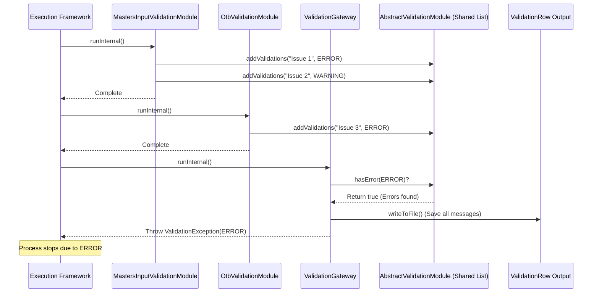
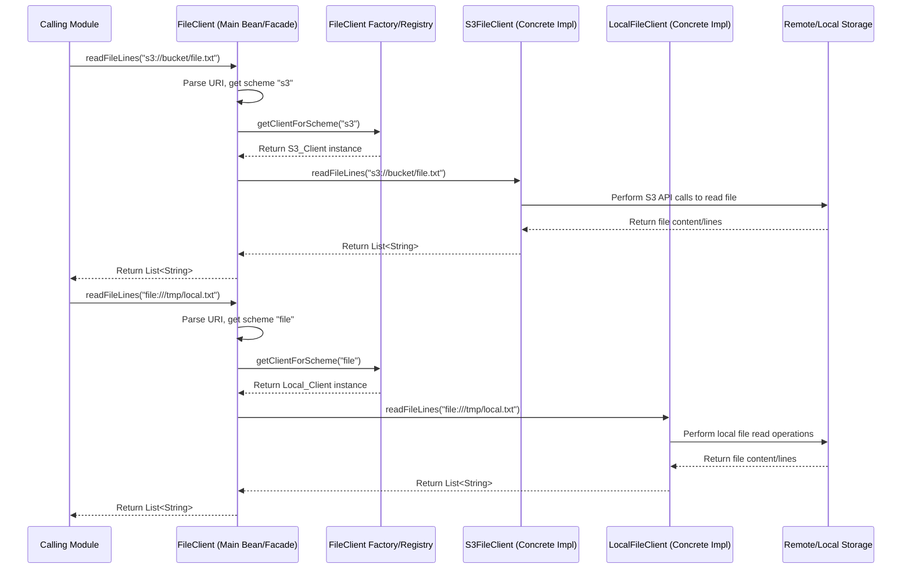
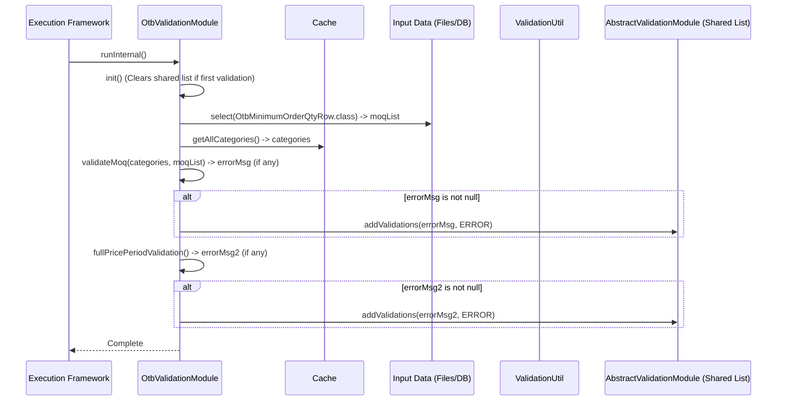

# Chapter 63: Validation Framework

Welcome back! In the [previous chapter](62_module_dependencies___validation_mapping__.md), we learned how **Module Dependencies & Validation Mapping** utilities define the correct order for running modules and specify which data quality checks are needed beforehand. We saw that before running a module like OTB, the system identifies prerequisite validations like `MASTER_INPUT_VALIDATION`.

But what *are* these validation checks? What exactly happens when `MASTER_INPUT_VALIDATION` runs? How does the system actually check the quality and consistency of the input data?

## What Problem Does the Validation Framework Solve?

Imagine you're about to bake a cake using a fancy, automated baking machine (our algorithm module). The recipe requires specific ingredients in specific amounts and formats (our input data). What happens if you accidentally use salt instead of sugar? Or forget the eggs entirely? Or use expired milk? The machine might still run, but the resulting cake will be a disaster!

Similarly, `irisx-algo` modules rely heavily on input data – product details, sales history, planogram information, inventory levels, configuration settings, etc. If this input data has problems like:
*   Missing information (e.g., no category listed for a style)
*   Incorrect formats (e.g., a date written as "Tomorrow" instead of "YYYY-MM-DD")
*   Logical inconsistencies (e.g., a promotion end date that's *before* its start date)
*   Violations of business rules (e.g., planning more items for a shelf than the shelf can actually hold according to the planogram)

...then running the core algorithms could lead to crashes, inaccurate results, bad planning decisions, and wasted time figuring out what went wrong.

The **Validation Framework** solves this problem. It acts like the **kitchen assistant** who meticulously checks all your ingredients *before* you put them into the automated baker. It's a dedicated system within `irisx-algo` designed purely for checking the quality, consistency, and integrity of input data *before* the main calculations begin.

## Core Idea: Specific Checks for Specific Data

The Validation Framework isn't just one big checker. It's a collection of specialized **Validation Modules**. Each module focuses on checking a specific type or aspect of the input data. Think of it like having different assistants: one checks the freshness of dairy (logical consistency), one checks if you have all the dry ingredients (missing data), and one checks if the oven temperature is set correctly (configuration).

Key components:

1.  **Validation Modules:** Individual modules performing specific checks. Examples include:
    *   `MastersInputValidationModule`: Checks core master data like products, stores, attributes.
    *   `DistributionInputValidationModule`: Checks data needed specifically for the distribution modules (planograms, warehouse mappings).
    *   `OtbValidationModule`: Checks inputs specific to the OTB calculation.
    *   `IssInputValidationModule`: Checks inputs for Ideal Size Set.
    *   *(Many others exist, mapped in [Chapter 62](62_module_dependencies___validation_mapping__.md))*

2.  **Types of Checks:** These modules look for various issues:
    *   **Missing Data:** Required fields being empty (e.g., a style missing its category).
    *   **Incorrect Formats:** Data not matching expected types (e.g., text where a number should be, invalid date formats).
    *   **Logical Inconsistencies:** Data that doesn't make sense (e.g., `endDate < startDate`).
    *   **Business Rule Violations:** Data conflicting with defined business logic (e.g., `Planogram Capacity < Minimum Display Quantity`, a mismatch between parent/child product attributes).
    *   **Referential Integrity:** Checking if an ID used in one file actually exists in the corresponding master file (e.g., does the `storeId` mentioned in a sales record exist in the store master?).

3.  **Logging Errors/Warnings:** When a validation module finds an issue, it doesn't immediately crash the system (usually). Instead, it logs the problem, typically classifying it as:
    *   **`Level.ERROR`:** A critical issue that likely makes subsequent calculations impossible or invalid.
    *   **`Level.WARNING`:** An issue that might indicate a problem or inconsistency but might not necessarily stop the main process.

4.  **`ValidationGateway`:** This is a special validation module, usually run *last* after all other required checks for a process. It checks if any `ERROR` level messages were logged by the preceding validation modules. If errors were found, the `ValidationGateway` throws a specific `ValidationException`, which stops the entire job run, preventing the main algorithm from running with bad data. If only warnings (or no issues) were found, the gateway allows the process to continue.

## How It Works (The Workflow)

As established in [Chapter 62](62_module_dependencies___validation_mapping__.md), the execution framework uses `ModuleValidations` to determine which checks to run before a target module.

1.  **Framework Identifies Checks:** Before running, say, `OtbGroupModule`, the framework calls `ModuleValidations.getValidations(...)` to get the list of required checks (e.g., `[MASTER_INPUT_VALIDATION, OTB_INPUT_VALIDATION, VALIDATION_GATEWAY]`).
2.  **Run Validation Modules Sequentially:** The framework executes each validation module in the list using the [Module Runner](04_module_runner_.md).
3.  **Validation Module Executes:**
    *   Each module (e.g., `OtbValidationModule`) loads the specific data it needs to check (often using `db().select(...)`).
    *   It performs its checks (comparing values, checking formats, looking for inconsistencies).
    *   If an issue is found, it calls `addValidations(errorMessage, Level.ERROR)` or `addValidations(warningMessage, Level.WARNING)`. This adds a `ValidationRow` object to a shared list managed by the `AbstractValidationModule` base class.
4.  **`ValidationGateway` Runs Last:** After all other specified validations are done, the `ValidationGateway` runs.
5.  **Gateway Checks for Errors:** It inspects the shared list of `ValidationRow` objects.
6.  **Stop or Continue:**
    *   If any `ValidationRow` has `Level.ERROR`, the gateway throws a `ValidationException`, stopping the process.
    *   If there are only `Level.WARNING` or no issues, the gateway finishes silently, and the framework proceeds to run the main calculation module (`OtbGroupModule`).
7.  **Output (`ValidationRow`):** Regardless of stopping, the `ValidationGateway` (or sometimes the individual modules) usually persists the collected list of `ValidationRow` objects. This allows users to download a report detailing all warnings and errors found during the run.

**Output Row (`ValidationRow.java`):**

```java
// File: src/main/java/com/increff/irisx/row/output/validation/ValidationRow.java
package com.increff.irisx.row.output.validation;

import com.increff.iris.commons.Level; // Enum: ERROR, WARNING, INFO

// Represents a single validation message
public class ValidationRow {
    public String module;    // Which validation module found the issue
    public Level type;       // Severity: ERROR or WARNING
    public String message;   // The error/warning message (primary language)
    public String messageEN; // The message in English (for reference)
}
```

## Under the Hood: The Abstract Module and Helpers

**1. Base Class (`AbstractValidationModule.java`):**
   All specific validation modules extend this base class. It provides the core functionality for collecting and managing validation messages.

   ```java
   // Simplified from AbstractValidationModule.java
   package com.increff.irisx.module.validation;

   import com.increff.iris.commons.Level;
   import com.increff.iris.commons.module.AbstractModule; // Base class for all modules
   import com.increff.irisx.constants.GenericConstants;
   import com.increff.irisx.row.output.validation.ValidationRow;
   import java.util.ArrayList;
   import java.util.List;
   import java.util.Optional;

   public abstract class AbstractValidationModule extends AbstractModule {

       // Shared list to hold all messages generated during a run
       private static List<ValidationRow> validations;
       // Name of the specific validation module (set by subclass)
       public String validationName;

       // Initialize or clear the list
       public void init() {
           validations = new ArrayList<>();
       }

       // Add a single message
       protected void addValidations(String error, Level Level) {
           if (error != null) {
               ValidationRow validationRow = new ValidationRow();
               // Split message based on separator (for multi-language)
               String[] errors = error.split(GenericConstants.VALIDATION_SEPERATOR, 2);
               validationRow.message = errors[0];
               validationRow.messageEN = error.length() > 1 ? errors[1] : errors[0];
               validationRow.type = Level;
               validationRow.module = validationName; // Tag with module name
               validations.add(validationRow);
           }
       }

       // Add multiple messages
       protected void addValidations(List<String> errors, Level Level) {
           if (errors != null && !errors.isEmpty()) {
               errors.forEach(k -> addValidations(k, Level));
           }
       }

       // Check if any errors/warnings exist
       public boolean hasError(Optional<Level> level) {
           if (!level.isPresent()) // Check for any messages
               return !validations.isEmpty();
           else // Check for specific level (e.g., ERROR)
               return validations.stream().anyMatch(k -> k.type.equals(level.get()));
       }

       // Persist the collected messages
       public void writeToFile() {
           db().truncateInsert(ValidationRow.class, new ArrayList<>(validations));
           db().persistTable(ValidationRow.class);
           db().clearTable(ValidationRow.class); // Clear from memory
       }

       protected void clear() {
           validations = null;
       }
   }
   ```
   **Explanation:** The base class manages a static `List<ValidationRow>`. The `addValidations` method allows subclasses to add messages to this shared list, tagging them with the module name and severity level. `hasError` checks the list, and `writeToFile` persists the results.

**2. Concrete Validation Module Example (`MastersInputValidationModule.java` - Simplified checks):**

   ```java
   // Simplified logic from MastersInputValidationModule.java
   @Component
   public class MastersInputValidationModule extends AbstractValidationModule {
       @Autowired private Cache cache;

       @Override
       protected void runInternal(Properties properties) throws ModuleException {
           init(); // Initialize the shared validation list
           this.validationName = ValidationModuleNames.MASTER_INPUT_VALIDATION;

           // --- Example Check 1: Ensure Stores are Enabled ---
           if (cache.getAllStores().isEmpty()) {
               addValidations(MastersInputValidationConstants.get(CHECK_STORE_ENABLED), Level.ERROR);
           }

           // --- Example Check 2: Ensure Styles are Enabled ---
           if (cache.getAllStyles().isEmpty()) {
               addValidations(MastersInputValidationConstants.get(CHECK_STYLE_ENABLED), Level.ERROR);
           }

           // --- Example Check 3: Check for Styles missing crucial attributes ---
           Set<Integer> stylesWithAttrs = cache.getAllStylesFromAttributes();
           List<String> stylesMissingAttrs = cache.getAllStyles().stream()
               .filter(styleId -> !stylesWithAttrs.contains(styleId))
               .map(styleId -> cache.getStyleRow(styleId).styleCode) // Get style code for message
               .collect(Collectors.toList());
           if (!stylesMissingAttrs.isEmpty()) {
               addValidations(MastersInputValidationConstants.get(CHECK_STYLE_ATTRIBUTE,
                   String.join(", ", stylesMissingAttrs)), Level.ERROR);
           }

           // --- Example Check 4: Check Parent/Child Attribute Consistency ---
           // (More complex logic calling helpers like matchPrimaryAttributes)
           // checkParentChildAttributes(); -> calls addValidations internally if issues found

           // --- Example Check 5: Using ValidationUtil Helper ---
           // Loop through input data rows (e.g., from db().select(SomeInputRow.class))
           // for (DataRow dr : db().select(SomeInputRow.class)) {
           //     // Validate 'endDate' is after 'startDate'
           //     addValidations(ValidationUtil.validateDuration(dr, "startDate", "endDate", "Promotion"), Level.ERROR);
           //     // Validate 'discount' is between 0 and 100
           //     addValidations(ValidationUtil.validateDouble(dr, "discount", "Discount", Optional.of(0.0), Optional.of(100.0)), Level.ERROR);
           // }

           // Note: Does NOT call writeToFile() here usually. Gateway does that.
       }
       // ... (helper methods like checkParentChildAttributes) ...
   }
   ```
   **Explanation:** A concrete module like `MastersInputValidationModule` overrides `runInternal`. It calls various check methods. These methods query data (often via the `Cache` or `db()`) and perform comparisons or checks. If a rule is violated, they call `addValidations` (inherited from the base class) to log the specific error or warning message with its severity level.

**3. The Gateway (`ValidationGateway.java`):**
   This module is simple but critical. It runs last and checks the result.

   ```java
   // Simplified from ValidationGateway.java
   @Component
   public class ValidationGateway extends AbstractValidationModule {

       @Override
       protected void runInternal(Properties properties) throws ValidationException {
           // Persist ALL collected validation messages
           writeToFile();

           // Check if any CRITICAL errors were logged by previous modules
           if (hasError(Optional.of(Level.ERROR))) {
               // If errors exist, stop the whole process
               throw new ValidationException("Error: Errors found in masters please download validation response", Level.ERROR);
           }

           // Check if any warnings were logged (optional, could just log)
           if (hasError(Optional.of(Level.WARNING))) {
               logger.warn("Warnings found in masters please download validation response");
               // Often throws a WARNING level exception for reporting, but doesn't stop the run
               // throw new ValidationException("Warning: ...", Level.WARNING);
           }

           // If no errors, execution continues past the gateway
           cleanUp(); // Clear the static list for the next run
       }

       // ... cleanUp() calls clear() ...
   }
   ```
   **Explanation:** The `ValidationGateway` first calls `writeToFile()` to save all collected messages (errors and warnings). Then, it uses `hasError(Optional.of(Level.ERROR))` to check specifically for errors. If errors are found, it throws a `ValidationException`, halting further execution. Otherwise, it completes, allowing the main algorithm module to proceed.

**Sequence Diagram (Framework Running Validations):**


## Conclusion

The **Validation Framework** in `irisx-algo` provides a structured and essential mechanism for ensuring data quality before complex calculations are performed.

*   It uses specialized **Validation Modules** (like `MastersInputValidationModule`, `DistributionInputValidationModule`) to check specific aspects of the input data.
*   Checks include verifying **formats, completeness, logical consistency, referential integrity, and business rules**.
*   Issues are logged as **Errors** or **Warnings** using a shared mechanism provided by `AbstractValidationModule`.
*   The **`ValidationGateway`** module runs last, checks if any critical **Errors** were logged, and **stops the process** if necessary by throwing a `ValidationException`.
*   All logged messages are typically persisted in `ValidationRow` format for user review.

This framework significantly increases the reliability and accuracy of the `irisx-algo` results by catching data problems early and preventing algorithms from running with faulty inputs.

After validating data, another common preparation step is ensuring data consistency. What if the same color is represented as "Blue", "blue", and "BLUE" in different places?

[Next Chapter: Data Normalization](64_data_normalization_.md)
```
---
# Chapter 64: Data Normalization

Welcome back! In the [previous chapter](63_validation_framework_.md), we explored the **Validation Framework**, our system for checking input data quality and consistency. It ensures we don't run algorithms with missing fields, incorrect formats, or logical errors like end dates before start dates.

But even if data *formats* are correct, we can still have inconsistencies in the *values* themselves. Think about product attributes like color or brand. What happens if:
*   One input file lists a color as "BLUE"?
*   Another file lists it as "Blue"?
*   A third file lists it as "blue"?
*   And maybe someone accidentally typed "Bl ue" with an extra space?

To the computer, these are four *different* strings. If we try to group products by color later, we might end up with four separate groups instead of one "Blue" group, leading to incorrect analysis and planning.

## What Problem Does Data Normalization Solve?

Imagine organizing a music library where different albums list the same artist slightly differently: "The Beatles", "Beatles, The", "beatles". If you sort by artist, they won't group together properly! You need a consistent way to represent the artist's name, perhaps always as "Beatles, The".

**Data Normalization** in `irisx-algo` solves this problem for key text-based data fields, especially attributes like brand names, colors, sizes, categories, etc. It provides a standard way to **clean up and standardize** these text values so that the same concept is always represented by the exact same string.

It tackles common issues like:
*   **Case Sensitivity:** Converts everything to a standard case (usually UPPERCASE). "Blue", "blue", and "BLUE" all become "BLUE".
*   **Extra Spaces:** Removes leading/trailing spaces and sometimes collapses multiple internal spaces. " Brand X " becomes "BRAND X".
*   **Special Characters:** Might remove or replace certain special characters that could cause issues (though the primary focus is usually case and spacing).

By applying these normalization rules consistently whenever text data is read or processed, we ensure that comparisons, groupings, and lookups work reliably. It guarantees that "BLUE" always matches "BLUE", preventing fragmentation of data and improving the accuracy of analysis.

## Core Idea: Standardizing Text Values

The core idea is simple: have a central function or utility that takes any input string (like a brand name or color) and transforms it into its standard, "normalized" form according to defined rules.

The primary rules usually are:
1.  Convert the entire string to **UPPERCASE**.
2.  **Trim** whitespace from the beginning and end.

This standardized string is then used throughout the system for comparisons, map keys, groupings, etc.

## How It's Used: Applying the Rules

Normalization isn't a standalone module you run. It's typically applied:

1.  **During Data Loading/Preparation:** When input files (like product masters, attribute files) are read, the normalization function is applied to specific text columns *before* the data is stored in memory (e.g., in the [Cache](05_cache_.md) or processed by validation modules).
2.  **Before Comparisons/Lookups:** If comparing an input value against stored data, both values should ideally be normalized first to ensure a correct match.

**Example:** Loading Product Attributes

Imagine reading an `AttributeRow` from an input file where `color = " Royal Blue "`.

```java
// Conceptual data loading step

String rawColor = attributeInputRow.getValue("color"); // Gets " Royal Blue "
String rawBrand = attributeInputRow.getValue("brand"); // Gets " brand x "

// Apply normalization
String normalizedColor = Normalize.normalize(rawColor); // Result: "ROYAL BLUE"
String normalizedBrand = Normalize.normalize(rawBrand); // Result: "BRAND X"

// Store the NORMALIZED values in the AttributeRow object or Cache
processedAttributeRow.color = normalizedColor;
processedAttributeRow.brand = normalizedBrand;
```
**Explanation:**
*   The raw values (" Royal Blue ", " brand x ") are read.
*   The `Normalize.normalize()` function is called for each.
*   This function applies the rules (uppercase, trim).
*   The resulting standardized values ("ROYAL BLUE", "BRAND X") are stored for later use.

Now, if another part of the system encounters "royal blue" or " ROYAL BLUE", normalizing it will also result in "ROYAL BLUE", allowing for correct matching and grouping.

## Under the Hood: The `Normalize` Utility

The logic for normalization is usually contained within a simple utility class, often called `Normalize` or similar, with a static method.

**Code Dive (`Normalize.java` or similar utility):**

```java
// This logic might reside in com.increff.irisx.api.Normalize.java
// or potentially a utility class in iris-commons.
package com.increff.irisx.api; // Example package

import com.google.common.base.CharMatcher; // From Google Guava library
import com.increff.irisx.util.StringUtil; // Local utility

public class Normalize {

    /**
     * Normalizes a string by trimming whitespace and converting to uppercase.
     * Handles null input gracefully.
     *
     * @param s The input string.
     * @return The normalized string (uppercase, trimmed), or null if input was null.
     */
    public static String normalize(String s) {
        // If the input is null or already empty, return it as is (or null)
        if (StringUtil.isNullOrEmpty(s)) {
            return s;
        }
        // 1. Trim whitespace from start and end
        // 2. Convert to UPPERCASE
        return s.trim().toUpperCase();
    }

    /**
     * Normalizes specifically for use as map keys.
     * Removes extra internal spaces and converts to uppercase.
     * Returns null if input is effectively empty after normalization.
     *
     * @param str The input string.
     * @return Normalized string suitable for keys, or null.
     */
    public static String normalizeStringForMapKey(String str) {
        // If null or empty initially, return null
        if (StringUtil.isNullOrEmpty(str)) {
            return null;
        }
        // Use Guava's CharMatcher to collapse multiple spaces into one
        // and trim whitespace from ends.
        String cleanedString = CharMatcher.whitespace().trimAndCollapseFrom(str, ' ');
        // If the string becomes empty after cleaning, return null
        if (StringUtil.isNullOrEmpty(cleanedString)) {
            return null;
        }
        // Convert to uppercase
        return cleanedString.toUpperCase();
    }

    // Potentially other normalization methods for specific cases...
}

// Helper utility referenced above (example)
// package com.increff.irisx.util;
// public class StringUtil {
//    public static boolean isNullOrEmpty(String s) {
//        return s == null || s.trim().isEmpty();
//    }
// }
```
**Explanation:**
*   The primary `normalize(String s)` method is very simple: it checks for null/empty input, then uses standard Java String methods `trim()` to remove leading/trailing whitespace and `toUpperCase()` to convert the case.
*   The `normalizeStringForMapKey` method is slightly more advanced. It uses Google Guava's `CharMatcher.whitespace().trimAndCollapseFrom(str, ' ')` which not only trims ends but also replaces sequences of internal whitespace characters (spaces, tabs, etc.) with a single space. This ensures keys like "BRAND  X" and "BRAND X" become the same ("BRAND X"). It also returns `null` if the string is empty after cleaning, which can be useful for map keys.

**Where is `Normalize.normalize()` used?**
You'll often find calls to `Normalize.normalize()` inside:
*   Input Row class constructors or setters when reading data.
*   Data loading modules before adding data to the Cache or `ImDbService`.
*   Validation modules when comparing input values against expected sets or formats.
*   Helper classes like `ObjectMaps` when creating map keys.

## Conclusion

**Data Normalization** is a simple but crucial data preparation step in `irisx-algo`, typically handled by a utility like `Normalize`.

*   It ensures that key text-based values (like brands, categories, colors, sizes) are **standardized** into a consistent format.
*   The most common rules are **trimming whitespace** and converting to **uppercase**.
*   Normalization is applied during **data loading** and before **comparisons or lookups**.
*   This prevents errors caused by minor variations in input (case, spacing) and ensures accurate **grouping, filtering, and analysis**.

By applying normalization consistently, the system maintains data integrity and ensures reliable processing throughout its various modules.

We've now covered many core concepts, modules, and utilities. But how is the whole application wired together? How does `OtbGroupModule` get access to `OtbStrComputeModule`? How are components like the `Cache` or `ImDbService` shared across different modules? This involves the underlying application framework.

[Next Chapter: Spring Configuration](65_spring_configuration_.md)
```
---
# Chapter 65: Spring Configuration

Welcome back! In the [previous chapter](64_data_normalization_.md), we learned about **Data Normalization**, a simple but important process for standardizing text data like brand names or colors. We've now seen many different pieces of `irisx-algo`:
*   Core algorithms (like OTB, OW, Distribution) broken into specific modules (e.g., `OtbStrComputeModule`, `OwInitWidthCalc`).
*   Orchestrator modules that group sequences of steps together (e.g., `OtbGroupModule`, `ApOwGroupModule` from [Chapter 61: Abstract Module Group](61_abstract_module_group_.md)).
*   Helper utilities (like `MathUtil`, `ObjectMaps`, `Normalize`).
*   Shared data components (like the [Cache](05_cache_.md)).
*   Entry points like [AppApi](01_application_api__appapi__.md) and [Worker API](02_worker_api_.md).

But how do all these pieces find each other and get connected? When `OtbGroupModule` needs `OtbStrComputeModule`, how does it get the correct instance? How does the `Cache` object get shared by so many different modules? This "wiring" is essential for the application to function.

## What Problem Does Spring Configuration Solve?

Imagine building a complex electronic device like a computer. It has many components: a CPU, RAM, graphics card, power supply, motherboard, etc. You can't just throw them all in a box! They need to be connected correctly through the motherboard's slots and wires. The motherboard defines *where* each component goes and *how* it connects to others. Someone needs to design this "wiring diagram".

In a large software application like `irisx-algo`, we have many software "components" (our modules, helpers, data services). Manually creating instances of every component and explicitly passing references between them (e.g., `OtbGroupModule group = new OtbGroupModule(new OtbStrComputeModule(), new OtbMoqAdjustmentModule(), ...);`) would be incredibly messy, tightly coupled, and hard to manage, especially as the application grows.

This is where the **Spring Framework** comes in, specifically its **Inversion of Control (IoC)** container and **Dependency Injection (DI)** capabilities. **Spring Configuration** is how we tell the Spring framework about our components and how they should be wired together.

It solves the problem of **managing the creation and interconnection of software components**. Instead of components creating their dependencies themselves, the Spring container creates the components and "injects" their dependencies when needed.

Think of Spring as the **master assembler** for our software components. We provide it with blueprints and instructions (the configuration), and it builds and connects everything for us.

## Core Concepts: Beans, DI, and Configuration

1.  **Spring IoC Container:** The core of Spring. It's responsible for creating, managing, and wiring together objects.
2.  **Beans:** Objects that are managed by the Spring IoC container are called "beans". In `irisx-algo`, most of our modules (like `OtbGroupModule`, `OtbStrComputeModule`), helpers (like `Cache`, `MathUtil` if managed), and services (like database access) are configured as Spring beans.
3.  **Dependency Injection (DI):** This is the main mechanism Spring uses for wiring. Instead of a component fetching its dependencies, the dependencies are "injected" into it by the container. We saw this frequently with the `@Autowired` annotation:
    ```java
    @Component // Mark OtbGroupModule as a Spring bean
    public class OtbGroupModule extends AbstractUtilModuleGroup {
        // Tell Spring: "Please inject the OtbStrComputeModule bean here"
        @Autowired
        private OtbStrComputeModule otbStrComputeModule;
        // ...
    }
    ```
    When Spring creates the `OtbGroupModule` bean, it sees `@Autowired` and automatically finds the already created `OtbStrComputeModule` bean and assigns it to the `otbStrComputeModule` field.

4.  **Configuration:** How we tell Spring about our beans and their dependencies. `irisx-algo` primarily uses **Java-based configuration** with annotations:
    *   **`@Configuration`:** Marks a class as a source of bean definitions.
    *   **`@Component` (and specializations like `@Service`, `@Repository`):** Marks a class as a candidate for auto-detection and bean creation. Most `irisx-algo` modules and helpers have this annotation. Spring scans packages to find these.
    *   **`@Bean`:** A method-level annotation within a `@Configuration` class. It indicates that the method produces a bean instance to be managed by Spring. Useful for configuring beans from external libraries or when more complex setup is needed.
    *   **`@Autowired`:** Marks a constructor, field, or setter method where a dependency should be injected.
    *   **`@PropertySource`:** Specifies the location of `.properties` files containing configuration values (like database URLs, default settings).
    *   **`@Value`:** Injects values from property files into fields.
    *   **`@Import`:** Allows one configuration class to import bean definitions from another.
    *   **`@Profile`:** Allows defining beans or configurations that are only active under certain conditions (like the `app-api-runner` profile we saw in [Chapter 4](04_module_runner_.md)).

## How It Works: The `AppSpringConfig` Blueprint

The central configuration blueprint for `irisx-algo` is typically the `AppSpringConfig.java` class.

**1. The Main Configuration Class (`AppSpringConfig.java`):**

```java
// File: src/main/java/com/increff/irisx/spring/AppSpringConfig.java
package com.increff.irisx.spring;

// Imports for Spring annotations and potentially other config classes
import org.springframework.context.annotation.*;
import org.springframework.context.support.PropertySourcesPlaceholderConfigurer;
import org.springframework.scheduling.annotation.EnableAsync; // Enable asynchronous methods
import org.springframework.scheduling.annotation.EnableScheduling; // Enable scheduled tasks
import org.springframework.transaction.annotation.EnableTransactionManagement; // Enable transaction management

@Configuration // << Marks this as the main configuration class
// Define where to find property files
@PropertySource(value = {"classpath:com/increff/irisx/config.properties"})
// Tell Spring to scan packages for components (@Component, @Service, etc.)
@ComponentScan(basePackages = {"com.increff.irisx"})
// Import configurations from other modules/libraries (e.g., database setup)
@Import({DbConfig.class, /* OtherConfig.class */})
@EnableTransactionManagement // Enable features like @Transactional
@EnableAsync
@EnableScheduling
public class AppSpringConfig {

    // Optional: Define specific beans using @Bean methods if needed
    // Example: Bean needed for resolving property placeholders like ${db.url}
    @Bean
    public static PropertySourcesPlaceholderConfigurer propertyConfigurer() {
        return new PropertySourcesPlaceholderConfigurer();
    }

    // Example: Define a bean for a specific utility if needed
    // @Bean
    // public MyCustomUtility myCustomUtility() {
    //     return new MyCustomUtility(/* constructor args */);
    // }
}
```
**Explanation:**
*   **`@Configuration`:** Identifies this class as the blueprint.
*   **`@PropertySource`:** Tells Spring to load configuration settings from `config.properties` found in the classpath.
*   **`@ComponentScan("com.increff.irisx")`:** This is crucial! It instructs Spring to automatically scan the entire `com.increff.irisx` package (and its sub-packages) for classes marked with `@Component`, `@Service`, `@Repository`, or `@Controller`. Spring will automatically create beans for all such classes it finds (like our modules `OtbGroupModule`, `Cache`, `MathUtil`, etc., assuming they have the `@Component` annotation). This avoids needing `@Bean` methods for every single module.
*   **`@Import({DbConfig.class, ...})`:** Pulls in configurations from other classes, often used to organize database setup (`DbConfig`), security setup, etc.
*   **`@Enable...` annotations:** Turn on specific Spring features like transaction management or asynchronous execution.
*   **`@Bean` methods:** Provide explicit bean definitions when needed, like the `PropertySourcesPlaceholderConfigurer` which helps Spring understand `${...}` placeholders in properties.

**2. Component Scanning in Action:**
   Because `AppSpringConfig` has `@ComponentScan("com.increff.irisx")`, Spring automatically finds classes like these:

   ```java
   // File: src/main/java/com/increff/irisx/module/otb/OtbStrComputeModule.java
   package com.increff.irisx.module.otb;
   // ... imports ...
   @Component // <<< Spring finds this!
   public class OtbStrComputeModule extends AbstractOtbModule {
       @Autowired // Spring injects this
       private Cache cache;
       @Autowired // Spring injects this
       private CommonData commonData;
       // ... logic ...
   }

   // File: src/main/java/com/increff/irisx/helper/Cache.java
   package com.increff.irisx.helper;
   // ... imports ...
   @Component // <<< Spring finds this!
   public class Cache {
       @Autowired // Spring injects this
       private ImDbService imdb;
       // ... logic ...
   }
   ```
   Spring automatically creates singleton instances (usually one per application context) of `OtbStrComputeModule` and `Cache` because they are marked with `@Component` and are within the scanned package.

**3. Application Startup:**
   When the application starts (e.g., via `WorkerApi` using `ContextProvider`), it creates a Spring `ApplicationContext` based on this configuration (`AppSpringConfig`).

   ```java
   // Simplified from ContextProvider.getContext()
   AnnotationConfigApplicationContext ctx = new AnnotationConfigApplicationContext();
   // Register the main configuration class
   ctx.register(AppSpringConfig.class);
   // Activate profiles if needed (e.g., from task properties)
   // ctx.getEnvironment().setActiveProfiles("profileName");
   // Load properties into the environment
   // MutablePropertySources sources = ctx.getEnvironment().getPropertySources();
   // sources.addFirst(new PropertiesPropertySource("taskProps", taskProperties));
   // Refresh the context to load beans
   ctx.refresh();
   return ctx; // Returns the fully wired context
   ```
   This context now contains all the beans defined or scanned by `AppSpringConfig`, with their dependencies automatically injected via `@Autowired`. Modules can then be retrieved from this context (`ctx.getBean(OtbGroupModule.class)`) and executed.

## Conclusion

**Spring Configuration**, primarily through the **`AppSpringConfig`** class and annotations like **`@Configuration`**, **`@ComponentScan`**, **`@Component`**, and **`@Autowired`**, is the mechanism `irisx-algo` uses to manage its components and their dependencies.

*   It allows the **Spring IoC container** to automatically **create and wire together** the application's modules, helpers, and services (as "beans").
*   **`@ComponentScan`** enables automatic detection of beans marked with `@Component`, simplifying configuration.
*   **`@Autowired`** enables **Dependency Injection**, where Spring automatically provides required dependencies to components, reducing boilerplate code and coupling.
*   This approach makes the application **modular, flexible, and easier to manage and test**.

Understanding Spring Configuration explains the underlying "magic" that connects all the different pieces of `irisx-algo` together seamlessly.

With the application components wired up, how does the system interact with the outside world, especially for reading input files and writing output files?

[Next Chapter: File Client Utility](66_file_client_utility_.md)
```
---
# Chapter 66: File Client Utility

Welcome! In the [previous chapter](65_spring_configuration_.md), we saw how **Spring Configuration** acts like the master assembler, automatically creating and wiring together all the different modules and components of `irisx-algo`.

Now, let's think about how `irisx-algo` interacts with the outside world, specifically with files. Algorithms need input data (like product masters, sales history, configurations) which often comes from files, and they produce output results (like allocation plans, buy recommendations, reports) which often need to be saved as files.

Where are these files stored? They probably aren't always on the same computer where the `irisx-algo` process is running. They might be on:
*   A shared network drive.
*   A cloud storage service like Amazon S3, Google Cloud Storage, or Azure Blob Storage.
*   An SFTP server.

How does `irisx-algo` reliably read input files from these potentially remote locations and write output files back to them, without having complex, location-specific code scattered throughout every module that needs file access?

## What Problem Does the File Client Utility Solve?

Imagine you need to send letters and packages to different addresses. Some are local, some are international, some need special handling. You wouldn't build a custom delivery truck and figure out all the international shipping logistics yourself every time! You'd use a **postal service or a courier company** (like FedEx or UPS). They provide a simple interface: you give them the package and the address, and they handle the complexities of getting it there, whether it's across town or across the world.

The **File Client Utility** (often implemented using a library like `common-client` providing `FileClient` or `SftpFileClient`) acts like this universal courier service for files within `irisx-algo`. It solves the problem of needing a **standard, simple way to interact with files regardless of their underlying storage location** (local disk, S3, SFTP, etc.).

It abstracts away the low-level details of connecting to different storage systems, handling credentials, listing directories, reading files, writing files, and managing potential errors. Modules that need to read or write data simply use the File Client, tell it the file path (often using a standardized URI format like `s3://bucket/path/file.tsv` or `file:///local/path/file.tsv`), and let the utility handle the rest.

## Core Idea: A Uniform Interface for File Operations

The core idea is to provide a consistent set of methods for common file operations, hiding the specific implementation details for different storage backends.

Key features:

1.  **Abstraction:** Modules interact with a generic `FileClient` interface or class, not directly with S3 SDKs, SFTP libraries, or local file APIs.
2.  **URI-Based Paths:** File locations are specified using Uniform Resource Identifiers (URIs), which include a scheme (`s3:`, `sftp:`, `file:`) indicating the storage type. The File Client uses this scheme to delegate the operation to the correct backend implementation.
3.  **Common Operations:** Provides standard methods like:
    *   `readFileLines(String uri)`: Reads lines from a remote or local file.
    *   `readFileAsString(String uri)`: Reads the entire file content as a string.
    *   `readFileStream(String uri)`: Gets an input stream to read the file.
    *   `writeFile(String uri, String content)`: Writes string content to a file.
    *   `writeFile(String uri, InputStream content)`: Writes content from an input stream.
    *   `listFiles(String directoryUri)`: Lists files in a directory.
    *   `deleteFile(String uri)`: Deletes a file.
    *   `exists(String uri)`: Checks if a file exists.
4.  **Configuration:** The connection details (like S3 bucket names, SFTP hostnames, credentials) are typically handled through external configuration files or environment variables, not hardcoded in the application logic.

## How It's Used

Modules that need to directly interact with external file systems (often input/output modules or utilities like `ImDbService` during its initial load phase) use the File Client.

**Example: Loading Input Data (Conceptual)**

Imagine an input module needs to load data from a TSV file stored in an S3 bucket.

```java
import com.nextscm.commons.client.core.FileClient; // Import the File Client interface
import org.springframework.beans.factory.annotation.Autowired;
import org.springframework.stereotype.Component;
import java.util.List;

@Component
public class MyInputLoader {

    @Autowired // Spring injects the configured FileClient bean
    private FileClient fileClient;

    public void loadDataFromS3(String fileUri) {
        // Example URI: "s3://my-data-bucket/inputs/products.tsv"
        System.out.println("Attempting to read file: " + fileUri);

        try {
            // Check if the file exists first
            if (fileClient.exists(fileUri)) {
                // Read all lines from the file using the file client
                List<String> lines = fileClient.readFileLines(fileUri);

                System.out.println("Successfully read " + lines.size() + " lines.");
                // Process the lines (e.g., parse TSV, create Row objects)
                // ... processData(lines) ...

            } else {
                System.err.println("Error: File not found at " + fileUri);
            }
        } catch (Exception e) {
            System.err.println("Error reading file " + fileUri + ": " + e.getMessage());
            // Handle exception
        }
    }
}
```
**Explanation:**
1.  The `MyInputLoader` component gets an instance of `FileClient` injected by Spring ([Chapter 65](65_spring_configuration_.md)). The specific implementation of `FileClient` (e.g., one that knows how to talk to S3) is determined by the application's configuration.
2.  The `loadDataFromS3` method takes a `fileUri` (e.g., `s3://...`).
3.  It uses `fileClient.exists()` to check if the file is accessible.
4.  It calls `fileClient.readFileLines(fileUri)` to read the content. The module code doesn't need to know *how* the `fileClient` connects to S3, handles authentication, or downloads the data; it just gets back a list of strings.
5.  The loaded lines can then be processed.

**Example: Writing Output Data (Conceptual)**

Imagine an output module needs to save results to a local file.

```java
// ... inside an output module ...
@Autowired
private FileClient fileClient;

public void saveResultsToLocalFile(String directoryUri, String fileName, String results) {
    // Example URI: "file:///opt/irisx/outputs/"
    String fullPathUri = directoryUri + fileName; // e.g., "file:///opt/irisx/outputs/results.csv"
    System.out.println("Attempting to write results to: " + fullPathUri);

    try {
        // Write the string content to the specified file URI
        fileClient.writeFile(fullPathUri, results);
        System.out.println("Successfully wrote results to " + fullPathUri);

    } catch (Exception e) {
        System.err.println("Error writing file " + fullPathUri + ": " + e.getMessage());
        // Handle exception
    }
}
```
**Explanation:**
1.  The module constructs the full file URI, using the `file:` scheme for local files.
2.  It calls `fileClient.writeFile(fullPathUri, results)`.
3.  The `fileClient` recognizes the `file:` scheme and uses the appropriate local file system operations to create/overwrite the file and write the `results` string to it. Again, the module doesn't need specific code for local file writing.

## Under the Hood: Delegation Based on URI Scheme

The `FileClient` usually acts as a **facade** or **dispatcher**.

1.  **Interface:** There's a common `FileClient` interface defining the standard methods (`readFileLines`, `writeFile`, `exists`, etc.).
2.  **Implementations:** There are separate classes that *implement* this interface for each supported storage type:
    *   `S3FileClient`: Contains logic to interact with Amazon S3 using the AWS SDK.
    *   `LocalFileClient`: Contains logic to interact with the local filesystem using standard Java file I/O.
    *   `SftpFileClient`: Contains logic to interact with SFTP servers using libraries like JSch.
    *   (Others for Azure, GCS, etc., might exist).
3.  **Configuration & Factory:** When the application starts, Spring configuration determines *which* concrete implementation(s) to create based on application properties (e.g., if S3 credentials are provided, create an `S3FileClient`). A central `FileClientFactory` or the main `FileClient` bean itself might hold references to these concrete clients.
4.  **Delegation:** When a method like `fileClient.readFileLines("s3://bucket/file")` is called:
    *   The main `FileClient` bean parses the URI to identify the scheme (`s3`).
    *   It looks up the appropriate concrete client registered for the `s3` scheme (the `S3FileClient` instance).
    *   It delegates the call to that specific client: `s3FileClient.readFileLines("s3://bucket/file")`.
    *   The `S3FileClient` then performs the actual S3 operation.

**Sequence Diagram (Simplified Read Operation):**



**Code Dive:**

*(Note: The actual FileClient implementation likely comes from a shared library like `common-client`, so we won't see its full source within `irisx-algo`. We'll show the conceptual structure and how it might be configured or used.)*

*   **Interface (Conceptual):**
    ```java
    // Interface likely defined in common-client library
    package com.nextscm.commons.client.core;
    // ... imports ...

    public interface FileClient {
        boolean exists(String uri);
        List<String> readFileLines(String uri) throws IOException;
        void writeFile(String uri, String content) throws IOException;
        void writeFile(String uri, InputStream inputStream) throws IOException;
        InputStream readFileStream(String uri) throws IOException;
        List<FileMeta> listFiles(String directoryUri) throws IOException;
        void deleteFile(String uri) throws IOException;
        // ... other methods like copy, move, etc. ...
    }
    ```
*   **Configuration (Conceptual Spring Bean Definition):**
    ```java
    // Within a @Configuration class, maybe DbConfig or a dedicated ClientConfig
    import com.nextscm.commons.client.CompositeFileClient; // Example main client
    import com.nextscm.commons.client.local.LocalFileClient;
    import com.nextscm.commons.client.s3.S3FileClient;
    import org.springframework.context.annotation.Bean;
    import org.springframework.context.annotation.Configuration;
    import org.springframework.beans.factory.annotation.Value;

    @Configuration
    public class ClientConfig {

        // Inject properties (e.g., from config.properties)
        @Value("${aws.accessKeyId:}") private String awsAccessKey;
        @Value("${aws.secretKey:}") private String awsSecretKey;
        // ... other properties for region, SFTP host, etc.

        @Bean // Define the main FileClient bean
        public FileClient fileClient() {
            // Create the composite client that handles delegation
            CompositeFileClient compositeClient = new CompositeFileClient();

            // Always add the local file client
            compositeClient.addClient(new LocalFileClient());

            // Conditionally add S3 client if credentials are provided
            if (awsAccessKey != null && !awsAccessKey.isEmpty()) {
                // Configure S3 client (details omitted)
                S3FileClient s3Client = new S3FileClient(/* credentials, region */);
                compositeClient.addClient(s3Client);
            }

            // Conditionally add SFTP client if config is provided
            // if (sftpHost != null) {
            //     SftpFileClient sftpClient = new SftpFileClient(/* host, user, key */);
            //     compositeClient.addClient(sftpClient);
            // }

            return compositeClient;
        }
    }
    ```
    **Explanation:** This conceptual Spring configuration defines the primary `FileClient` bean. It creates a `CompositeFileClient` which acts as the delegator. It always adds a `LocalFileClient`. Then, based on whether AWS or SFTP configuration properties are present, it conditionally creates and adds the specific clients (`S3FileClient`, `SftpFileClient`). When a module `@Autowired`s `FileClient`, Spring provides this configured `CompositeFileClient` instance.

## Conclusion

The **File Client Utility** provides a crucial abstraction layer for interacting with files in `irisx-algo`.

*   It offers a **uniform interface** (`FileClient`) for common file operations (read, write, list, exists, delete).
*   It uses **URI schemes** (`s3:`, `file:`, `sftp:`) to identify the target storage system.
*   It **hides the complexity** of interacting with different backends (local disk, S3, SFTP).
*   Modules use the injected `FileClient` bean and standard URIs, making the code **cleaner, more portable, and independent** of the underlying file storage location.
*   Configuration details for different storage systems are managed externally.

This utility ensures that `irisx-algo` can reliably read its inputs and write its outputs, regardless of where the files physically reside.

Now that we've seen how the application is configured and interacts with files, how do we ensure the code itself works correctly and continues to work as changes are made? This brings us to testing.

[Next Chapter: Regression Testing Framework](67_regression_testing_framework_.md)
```
---
# Chapter 63: Validation Framework

Welcome back! In the [previous chapter](62_module_dependencies___validation_mapping__.md), we learned how **Module Dependencies & Validation Mapping** utilities define the correct order for running modules and specify which data quality checks are needed beforehand. We saw that before running a module like OTB, the system identifies prerequisite validations like `MASTER_INPUT_VALIDATION`.

But what *are* these validation checks? What exactly happens when `MASTER_INPUT_VALIDATION` runs? How does the system actually check the quality and consistency of the input data *before* launching into complex calculations?

## What Problem Does the Validation Framework Solve?

Imagine you're a chef about to follow a complex recipe using lots of ingredients (our input data). Before you start mixing, you'd naturally check your ingredients:
*   Are any missing? (Missing Data)
*   Are the quantities correct? (Format/Range Check)
*   Is the milk fresh? Is the "Use By" date *after* today's date? (Logical Consistency)
*   Did you remember you're baking for someone with a nut allergy and check if any ingredients contain nuts? (Business Rule Violation)

Skipping these checks could lead to a failed dish (an algorithm error), a bad-tasting result (inaccurate output), or even making someone sick (bad business decisions based on faulty data).

Similarly, `irisx-algo` algorithms rely heavily on input data. Running them with flawed data is risky. The **Validation Framework** solves this by acting like the meticulous *prep chef* who inspects all the ingredients before the main cooking begins. It's a dedicated system designed to:

1.  **Check Input Data Quality:** Verify data formats, check for missing values.
2.  **Ensure Consistency:** Look for logical contradictions (e.g., end dates before start dates).
3.  **Enforce Business Rules:** Check for violations specific to the retail domain (e.g., planogram capacities, attribute consistency).
4.  **Report Issues:** Log any found problems clearly as errors or warnings.
5.  **Prevent Bad Runs:** Stop the main algorithm from running if critical errors are found.

This framework ensures that algorithms run with data that is as clean, consistent, and logical as possible, increasing the reliability and trustworthiness of the results.

## Core Idea: Specific Checks for Specific Data

The Validation Framework isn't a single, monolithic checker. It's built around several key components:

1.  **Validation Modules:** These are individual, specialized modules, each responsible for checking a particular type of data or a specific set of rules. They often extend a common base class, `AbstractValidationModule`. Examples include:
    *   `MastersInputValidationModule`: Checks core master data files (Stores, Styles, SKUs, Attributes, etc.).
    *   `DistributionInputValidationModule`: Checks inputs specific to the distribution process (Planograms, Warehouse Mappings, Store flags).
    *   `OtbValidationModule`: Validates data needed for OTB calculations (MOQ rules, Return rates).
    *   *(Many others exist, corresponding to different algorithm inputs)*

2.  **Types of Checks:** Within these modules, various checks are performed:
    *   **Format/Type Checks:** Is a quantity field actually a number? Is a date field in 'YYYY-MM-DD' format? (Uses helpers like `ValidationUtil.checkInt`, `ValidationUtil.checkLocalDate`).
    *   **Missing Data Checks:** Are mandatory fields (like `styleCode` or `category`) present? (`ValidationUtil.validateEmptyString`).
    *   **Referential Integrity Checks:** Does the `storeId` listed in a sales file exist in the `StoreRow` master data? (`ValidationUtil.checkAndValidateInSet`).
    *   **Logical Consistency Checks:** Is `endDate` after `startDate`? Is `minDiscount` less than or equal to `maxDiscount`? (`ValidationUtil.validateDuration`).
    *   **Business Rule Checks:** Does the sum of sizes match the parent style? Does the planogram capacity align with minimum display quantities? (These often involve more complex, custom logic within the specific validation module).

3.  **Error/Warning Logging (`ValidationRow`):** When a check fails, the module doesn't usually crash. Instead, it logs the issue by creating a `ValidationRow` object and adding it to a shared list. Each `ValidationRow` records:
    *   Which module found the issue (`module`).
    *   The severity (`type`: `Level.ERROR` or `Level.WARNING`).
    *   The error message (`message`, `messageEN`).

4.  **The Gateway (`ValidationGateway`):** This is a special module that runs *after* all other relevant validation modules for a process have completed. Its job is simple:
    *   Check the shared list of `ValidationRow` messages.
    *   If *any* messages with `Level.ERROR` exist, throw a `ValidationException` to stop the entire workflow.
    *   If only `Level.WARNING` messages (or no messages) exist, let the process continue.
    *   It also typically handles persisting the final list of `ValidationRow` messages so users can see the full report.

## How It Works (The Workflow)

The Validation Framework integrates seamlessly with the module execution process defined in [Chapter 62: Module Dependencies & Validation Mapping](62_module_dependencies___validation_mapping__.md).

1.  **Identify Required Validations:** Before running a target module (e.g., `OtbGroupModule`), the execution framework uses `ModuleValidations.getValidations(...)` to get the list of required validation module names (e.g., `[MASTER_INPUT_VALIDATION, OTB_INPUT_VALIDATION, VALIDATION_GATEWAY]`).
2.  **Execute Validation Modules:** The framework runs each validation module in the list sequentially.
3.  **Perform Checks:** Inside each validation module (e.g., `OtbValidationModule`), the `runInternal` method executes various checks on the relevant input data (often loaded via `db().select(...)` or using the [Cache](05_cache_.md)). Helper utilities like `ValidationUtil` are often used for common checks (formats, ranges).
4.  **Log Issues:** If a check fails, the module calls `addValidations(message, Level.ERROR)` or `addValidations(message, Level.WARNING)`. This adds a `ValidationRow` to a static list managed by the `AbstractValidationModule` base class.
5.  **Run the Gateway:** After all specific validation modules finish, the `ValidationGateway` runs.
6.  **Check for Errors:** The gateway checks the static list using `hasError(Optional.of(Level.ERROR))`.
7.  **Persist Results & Stop/Proceed:** The gateway calls `writeToFile()` to save all logged `ValidationRow` messages. If errors were found, it throws a `ValidationException`. Otherwise, it completes normally, signaling to the framework that it's safe to proceed with the main calculation module.

**Example Outcome:** If `MASTER_INPUT_VALIDATION` finds an ERROR (e.g., a required style attribute is missing) and `OTB_INPUT_VALIDATION` finds only WARNINGS (e.g., an MOQ value seems unusually high), the `ValidationGateway` will detect the ERROR and throw an exception, stopping the `OtbGroupModule` from running. The user can then check the persisted `ValidationRow` output to see all three issues logged.

## Under the Hood: Abstract Module, Helpers, and Gateway

**1. Base Class (`AbstractValidationModule.java`):**
   Provides the common structure for logging messages. (See code snippet in Chapter 62's "Under the Hood" section). Key methods: `init()`, `addValidations()`, `hasError()`, `writeToFile()`, `clear()`.

**2. Validation Helpers (`ValidationUtil.java`):**
   Contains static methods for common, reusable checks (like checking if a string is a valid integer within a range, if a date format is correct, if a value exists in a set).

   ```java
   // Simplified examples from ValidationUtil.java
   public class ValidationUtil {

       // Checks if a column value is a valid integer
       public static List<String> checkInt(DataRow r, String col) {
           try {
               r.getInteger(col); // Try to parse as Integer
               return Collections.emptyList(); // Success
           } catch (Exception e) {
               // Failed: return error message list
               return Arrays.asList(r.getNumber() + 1 + ": Invalid " + col + "...");
           }
       }

       // Checks if a column value is a valid LocalDate in expected format
       public static List<String> checkLocalDate(DataRow r, String col) {
           try {
               LocalDate value = r.getLocalDate(col); // Try to parse
               // Optional: check specific format if needed
               // if (!formatter.format(value).equals(r.getValue(col))) throw ...
               return Collections.emptyList();
           } catch (Exception t) {
               return Arrays.asList(r.getNumber() + 1 + ": Invalid " + col + "...");
           }
       }

       // Checks if start date is before or equal to end date
       public static List<String> validateDuration(DataRow dr, String startCol, String endCol, String errorMsg) {
           // ... (check formats first) ...
           LocalDate startDate = dr.getLocalDate(startCol);
           LocalDate endDate = dr.getLocalDate(endCol);
           if (startDate.isAfter(endDate)) {
               return Arrays.asList(dr.getNumber() + 1 + ": " + errorMsg + " End Date cannot be before Start Date");
           }
           return Collections.emptyList();
       }

       // Checks if a value exists in a provided Set
       public static List<String> checkAndValidateInSet(DataRow dr, String value, Set<?> existingValues, String msg) {
           if (!existingValues.contains(Normalize.normalize(value))) // Use normalization!
               return Arrays.asList(dr.getNumber() + 1 + ": Invalid " + msg + ": " + value);
           return Collections.emptyList();
       }

       // ... many other helpers for doubles, flags, empty strings, ranges ...
   }
   ```
   **Explanation:** These static utility methods perform common low-level checks, making the code in the specific validation modules cleaner and more focused on the *what* rather than the *how* of basic validation. They typically return an empty list if the check passes, or a list containing error message strings if it fails. Notice the use of [Data Normalization](64_data_normalization_.md) (`Normalize.normalize`) when checking against sets.

**3. Concrete Validation Module (`OtbValidationModule.java` - Simplified):**
   This module checks inputs specific to OTB.

   ```java
   // Simplified logic from OtbValidationModule.java
   @Component
   public class OtbValidationModule extends AbstractValidationModule {
       @Autowired private Cache cache;
       @Autowired private CommonData commonData;

       @Override
       protected void runInternal(Properties properties) {
           init(); // Prepare validation list
           this.validationName = ValidationModuleNames.OTB_INPUT_VALIDATION;
           logger.info("Validating OTB inputs");

           // --- Check 1: MOQ Input ---
           Map<Key, OtbMinimumOrderQtyRow> moqMap = ObjectMaps.getMapOfObjectFromList(
               db().select(OtbMinimumOrderQtyRow.class), k -> new Key(k.category));
           // Use a static helper method for the check logic
           addValidations(validateMoq(cache.getAllCategories(), moqMap), Level.ERROR);

           // --- Check 2: Full Price Period ---
           // Use a local helper method
           addValidations(fullPricePeriodValidation(), Level.ERROR);

           // --- Check 3: Minimum Display Options vs Planogram Attribute ---
           // Get relevant data
           List<OtbMinDisplayRow> mdoRows = db().select(OtbMinDisplayRow.class);
           Map<String, Set<String>> catAttrMap = getCatAttributeMap(/*...*/); // Uses Cache, View
           // Call a static helper for the check logic
           addValidations(checkOTBMinDisplayAttribute(mdoRows, /* other inputs */, catAttrMap), Level.ERROR);

           logger.info("OTB Inputs Validated");
           // Gateway will handle writeToFile()
       }

       // Helper method defined within this class
       private String fullPricePeriodValidation() {
           Set<Integer> fpPeriods = commonData.getPeriodsOfType(PeriodType.FULL_PRICE_PERIOD);
           if (fpPeriods.isEmpty()) return OtbValidationConstants.get(FULL_PRICE_VALIDATION_PERIOD);
           if (fpPeriods.size() > 1) return OtbValidationConstants.get(FULL_PRICE_VALIDATION_PERIOD1);
           return null;
       }

       // Static helper method (could be in ValidationUtil or local)
       private static String validateMoq(Set<String> allCategories, Map<Key, OtbMinimumOrderQtyRow> moqInputMap) {
           List<String> missingCats = allCategories.stream()
               .filter(cat -> moqInputMap.get(new Key(cat)) == null)
               .collect(Collectors.toList());
           if (!missingCats.isEmpty())
               return OtbValidationConstants.get(VALIDATE_MOD, String.join(", ", missingCats));
           return null;
       }
        // ... other helpers like getCatAttributeMap, checkOTBMinDisplayAttribute ...
   }
   ```
   **Explanation:** This module focuses on OTB inputs. It loads specific data like MOQ rules and Minimum Display rules. It calls helper methods (either static or local) to perform the checks (e.g., `validateMoq`, `fullPricePeriodValidation`). If helpers return error messages, `addValidations` logs them.

**4. The Gateway (`ValidationGateway.java`):**
   Its role is final check and potential stop. (See code snippet in Chapter 62's "Under the Hood" section).

**Sequence Diagram (Validation Module Running):**


**Explanation:** The framework runs the validation module. The module loads the data it needs to check (from DB or Cache), calls internal or utility methods to perform checks. If checks fail, messages are added to the shared list via `addValidations`.

## Conclusion

The **Validation Framework** provides a robust and systematic way to check the quality and consistency of input data before running core `irisx-algo` computations.

*   It consists of specialized **Validation Modules** (e.g., `MastersInputValidationModule`, `OtbValidationModule`) that perform specific checks.
*   Checks cover **formats, missing data, logical consistency, referential integrity, and business rules**.
*   Issues are logged as **Errors** or **Warnings** into a shared list.
*   The **`ValidationGateway`** runs last, persists all messages, and **stops the process if critical Errors were found**, preventing algorithms from running with bad data.
*   Helper utilities like **`ValidationUtil`** provide reusable functions for common checks.

By catching data problems early, this framework significantly improves the reliability and accuracy of the entire `irisx-algo` planning process.

After data is validated, we often need to ensure text values are standardized. How does the system handle variations like "BLUE", "Blue", and "blue"?

[Next Chapter: Data Normalization](64_data_normalization_.md)
```

---

Generated by [AI Codebase Knowledge Builder](https://github.com/The-Pocket/Tutorial-Codebase-Knowledge)