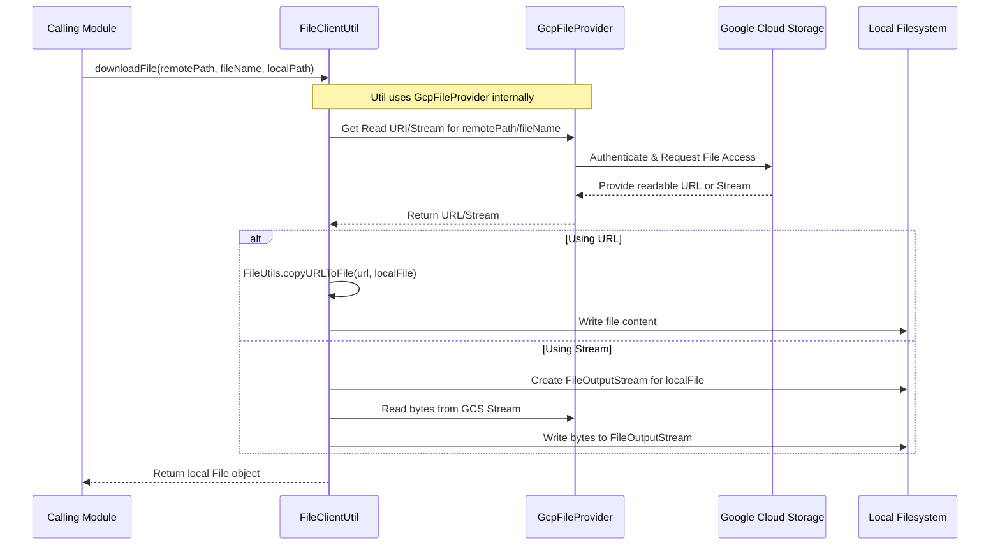
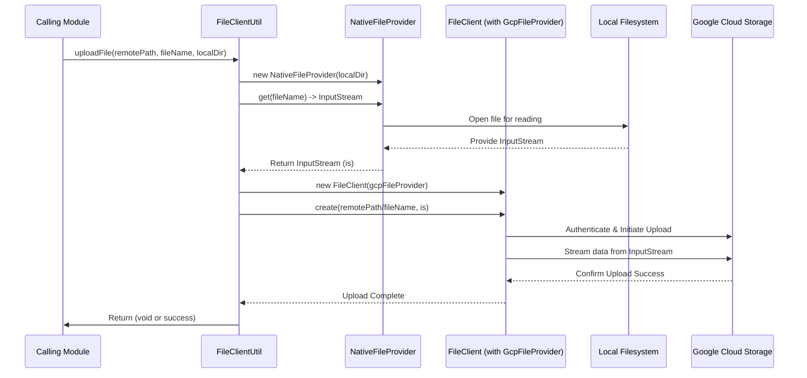
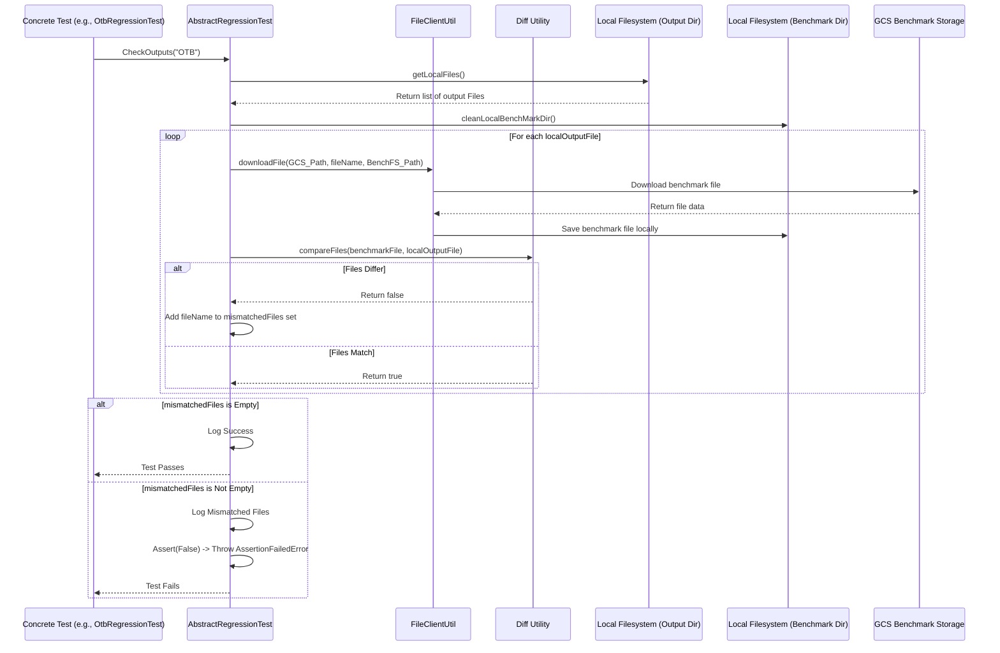

# Chapter 66: File Client Utility

Welcome back! In the [previous chapter](65_spring_configuration_.md), we saw how **Spring Configuration** acts like the master assembler, automatically creating and wiring together all the different modules and components of `irisx-algo`. This setup allows modules to work together seamlessly.

Now, let's think about a fundamental need for any data processing application: interacting with files. Our algorithms need input data (like product lists, sales history, configuration files) and they produce output results (like OTB plans, distribution lists, reports). Where do these files live, and how does the algorithm read and write them?

## What Problem Does the File Client Utility Solve?

Imagine you need to get a specific document. Sometimes it's stored right on your computer's desktop (local storage). Other times, it might be stored online in a service like Google Drive or Dropbox (cloud storage, like Google Cloud Storage - GCS). Maybe it's even on a secure company server you access via SFTP.

If every part of `irisx-algo` that needed to read or write a file had to include specific code for *each* possible location (local disk code, GCS code, SFTP code), our application would become very complicated and messy! If we ever changed where we store files (e.g., moved from local disks to GCS), we'd have to update code in dozens of places.

The **File Client Utility** solves this problem. Think of it like a universal **file courier service** for `irisx-algo`. You tell the service *what* file you want (using a special address called a URI) and *what* you want to do (read it, write to it, check if it exists), and the service figures out *how* to do it, whether the file is local or stored far away in the cloud (like GCS).

It provides a **single, consistent way** for modules to interact with files, hiding the complex details of connecting to different storage systems.

## Core Idea: A Uniform Interface for File Operations

The main idea is to **abstract away** the underlying storage mechanism. Modules don't need to know *how* to talk to Google Cloud Storage or the local file system; they just talk to the File Client Utility.

Key aspects:

1.  **Standard Methods:** The utility provides a set of common file operations, like:
    *   `downloadFile(...)`: Copy a file from a source (like GCS) to the local machine where the algorithm runs.
    *   `uploadFile(...)`: Copy a file from the local machine to a destination (like GCS).
    *   `readFileLines(...)` (Conceptual): Read the lines of text from a file.
    *   `writeFile(...)` (Conceptual): Write content to a file.
    *   `exists(...)` (Conceptual): Check if a file exists at a location.
    *   `listFiles(...)` (Conceptual): See what files are in a directory.
2.  **URIs for Location:** Instead of simple file paths like `C:\data\input.tsv`, locations are often specified using Uniform Resource Identifiers (URIs). URIs include a "scheme" that tells the File Client *what kind* of storage it is:
    *   `file:///c:/data/input.tsv`: A local file.
    *   `gs://my-algo-bucket/inputs/products.tsv`: A file in Google Cloud Storage (GCS).
    *   `s3://my-other-bucket/results/output.csv`: A file in Amazon S3 (if supported).
    *   `sftp://user@host/path/data.zip`: A file on an SFTP server (if supported).
3.  **Backend Providers:** The File Client Utility internally uses specific "providers" or clients for each scheme (like `GcpFileProvider`, `NativeFileProvider` for local files, etc.). It uses the scheme from the URI to choose the correct provider to handle the actual work.

## How It's Used

Modules needing to interact with files, especially during input loading or output saving, use the File Client Utility. In `irisx-algo`, a common pattern is to use it to download necessary input files from a central location (like GCS) to the local directory where the algorithm will run, and then upload result files from the local directory back to GCS.

**Example: Downloading an Input File**

Let's say the OTB module needs the `OtbMinimumOrderQtyRow.tsv` file, which is stored in a GCS bucket.

```java
// Inside a module or data loading utility

import com.increff.irisx.util.FileClientUtil; // Import our utility
import org.springframework.beans.factory.annotation.Autowired;
import org.springframework.beans.factory.annotation.Value;
import org.springframework.stereotype.Component;
import java.io.File;

@Component
public class OtbInputLoader {

    @Autowired // Spring injects the utility bean
    private FileClientUtil fileClientUtil;

    @Value("${iris.inputDir.remoteDir}") // e.g., "gs://irisx-prod-data/inputs"
    private String remoteInputDir;

    @Value("${iris.localDir}") // e.g., "/tmp/irisx_run_123/data"
    private String localDir;

    public File prepareMoqInput() {
        String fileName = "OtbMinimumOrderQtyRow.tsv";
        String remoteFilePath = remoteInputDir + "/" + "OTB"; // Path within bucket

        System.out.println("Downloading MOQ rules from: " + remoteFilePath + "/" + fileName);
        System.out.println("Saving to local directory: " + localDir);

        try {
            // Use the utility to download the file
            File localFile = fileClientUtil.downloadFile(
                                 remoteFilePath, // Where to find it in GCS
                                 fileName,       // Which file to get
                                 localDir        // Where to save it locally
                             );

            System.out.println("Successfully downloaded MOQ file to: " + localFile.getAbsolutePath());
            return localFile; // Return the local file path for processing

        } catch (Exception e) {
            System.err.println("Failed to download MOQ file: " + e.getMessage());
            // Handle error appropriately
            return null;
        }
    }
}
```
**Explanation:**
1.  The `OtbInputLoader` gets the `FileClientUtil` injected.
2.  It defines the remote GCS location (`remoteFilePath`) and the desired local directory (`localDir`).
3.  It calls `fileClientUtil.downloadFile()`, providing the remote path, filename, and local destination.
4.  The `FileClientUtil` handles connecting to GCS (using configured credentials), finding the file, downloading it, and saving it to the specified local directory.
5.  The module now has the file locally and can read it using standard file reading methods.

**Expected Output:**
```
Downloading MOQ rules from: gs://irisx-prod-data/inputs/OTB/OtbMinimumOrderQtyRow.tsv
Saving to local directory: /tmp/irisx_run_123/data
Successfully downloaded MOQ file to: /tmp/irisx_run_123/data/OtbMinimumOrderQtyRow.tsv
```

**Example: Uploading an Output File**

After the OTB module finishes, it might save the results locally first, and then upload the final `OtbStyleBuyOutputRow.tsv` file to GCS.

```java
// Inside an output handling utility or the OtbOutputModule

// ... (previous code: generate results and save to localFilePath) ...
// localFilePath = "/tmp/irisx_run_123/data/OtbStyleBuyOutputRow.tsv"
// fileName = "OtbStyleBuyOutputRow.tsv"

@Autowired
private FileClientUtil fileClientUtil;

@Value("${iris.outputDir.remoteDir}") // e.g., "gs://irisx-prod-data/outputs"
private String remoteOutputDir;

public void uploadOtbResults(String localFilePath, String fileName) {
    String remoteFilePath = remoteOutputDir + "/" + "OTB"; // Path within bucket
    System.out.println("Uploading results file: " + fileName);
    System.out.println("From local path: " + localFilePath);
    System.out.println("To remote path: " + remoteFilePath);

    try {
        // Use the utility to upload the file
        fileClientUtil.uploadFile(
            remoteFilePath, // Where to put it in GCS
            fileName,       // Name for the remote file
            localFilePath   // Path to the local file to upload
        );
        System.out.println("Successfully uploaded " + fileName);

    } catch (Exception e) {
        System.err.println("Failed to upload results file: " + e.getMessage());
        // Handle error appropriately
    }
}
```
**Explanation:**
1.  The code defines the local file path and the target remote path in GCS.
2.  It calls `fileClientUtil.uploadFile()`.
3.  The `FileClientUtil` reads the local file and handles connecting to GCS and uploading the file content to the specified remote path.

**Expected Output:**
```
Uploading results file: OtbStyleBuyOutputRow.tsv
From local path: /tmp/irisx_run_123/data/OtbStyleBuyOutputRow.tsv
To remote path: gs://irisx-prod-data/outputs/OTB
Successfully uploaded OtbStyleBuyOutputRow.tsv
```

In both examples, the calling code uses simple methods and doesn't need to know the specifics of GCS interaction.

## Under the Hood: Using File Providers

The `FileClientUtil` provided in the context acts as a wrapper or utility layer around underlying file providers. In this case, it seems primarily focused on interacting with Google Cloud Storage (GCS) via `GcpFileProvider` and the local file system via `NativeFileProvider`.

1.  **Providers:** Specific classes handle interaction with each storage type:
    *   `GcpFileProvider`: Knows how to use Google Cloud client libraries to connect, authenticate, read, write, list files in GCS buckets. Requires configuration like project ID, bucket name, credentials (often handled via environment setup or service accounts).
    *   `NativeFileProvider`: Uses standard Java `java.io.File` and related classes to interact with the local disk.
    *   *(Other providers like `S3FileProvider`, `SftpFileProvider` could exist in the `common-client` library if needed and configured).*
2.  **`FileClient` (from `common-client`):** Often, there's an underlying `FileClient` class (like `CompositeFileClient` mentioned conceptually in [Chapter 65](65_spring_configuration_.md)) that takes a URI, parses the scheme (`gs:`, `file:`), and delegates the actual operation to the correct registered provider (`GcpFileProvider`, `NativeFileProvider`).
3.  **`FileClientUtil`:** The utility class in `irisx-algo` simplifies common tasks.
    *   For `downloadFile`, it likely uses the `GcpFileProvider` (or a `FileClient` configured with it) to get a readable URL or stream for the GCS file, then uses a library like Apache Commons IO (`FileUtils.copyURLToFile`) or standard Java I/O to copy the data to a local file.
    *   For `uploadFile`, it likely uses the `NativeFileProvider` to get an `InputStream` for the local file and then passes that stream to the `GcpFileProvider`'s (or `FileClient`'s) `create` or `write` method to upload it to GCS.

**Sequence Diagram (Simplified `downloadFile`):**



**Code Dive (`FileClientUtil.java`):**

Let's look at the actual utility class provided.

```java
// File: src/main/java/com/increff/irisx/util/FileClientUtil.java
package com.increff.irisx.util;

import com.increff.iris.commons.module.ModuleException;
// Imports from common-client library for file handling
import com.nextscm.commons.fileclient.FileClient;
import com.nextscm.commons.fileclient.FileClientException;
import com.nextscm.commons.fileclient.GcpFileProvider; // Google Cloud provider
import com.nextscm.commons.fileclient.NativeFileProvider; // Local file provider
import org.apache.commons.io.FileUtils; // Apache library for file operations
import org.apache.log4j.Logger;
import org.springframework.beans.factory.annotation.Autowired;
import org.springframework.stereotype.Component;

import java.io.*;
import java.net.URL;
// ... (Zip imports) ...

@Component // Mark as a Spring bean
public class FileClientUtil {
    private static final Logger logger = Logger.getLogger(FileClientUtil.class);

    // Inject the GCS provider (configured elsewhere by Spring)
    @Autowired
    private GcpFileProvider fileProvider;

    /** Downloads a file from GCS to a local directory */
    public File downloadFile(String bucketFileLocation, String fileName, String localFileLocation) {
        // Create a FileClient instance configured with the GcpFileProvider
        FileClient fc = new FileClient(fileProvider);
        try {
            // Get a readable URI (likely a signed URL for GCS)
            String fileUrl = fc.getReadUri(bucketFileLocation + "/" + fileName);
            logger.info("downloadIngFile :" + bucketFileLocation + "/" + fileName);
            URL url = new URL(fileUrl);
            // Ensure local directory exists
            new File(localFileLocation).mkdirs();
            File localFile = new File(localFileLocation + "/" + fileName);
            // Use Apache Commons IO to copy from the URL to the local file
            FileUtils.copyURLToFile(url, localFile);
            return localFile;
        } catch (IOException e) {
            logger.error("Unable to download file " + fileName + " from " + bucketFileLocation, e);
            throw new ModuleException("unable to download file", e);
        }
    }

    /** Uploads a local file to GCS */
    public void uploadFile(String bucketFileLocation, String fileName, String localFileLocation) throws IOException {
        // Create a FileClient instance for GCS
        FileClient fc = new FileClient(fileProvider);
        InputStream is = null;
        try {
            // Use NativeFileProvider to get an InputStream for the local file
            NativeFileProvider nativeFileProvider = new NativeFileProvider(localFileLocation);
            is = nativeFileProvider.get(fileName); // Get stream for the local file name within the local dir
            // Use the GCS FileClient to create/write the file in the bucket using the stream
            fc.create(bucketFileLocation + "/" + fileName, is);
            logger.info("Uploaded file " + fileName + " to " + bucketFileLocation);
        } catch (FileClientException e) {
            logger.error("Failed to upload file " + fileName + " : " + e);
            throw new IOException("Failed to upload file " + fileName, e);
        } finally {
            // Ensure the input stream is closed
            if (is != null) {
                is.close();
            }
        }
    }

    /** Deletes a file from the local filesystem */
    public void deleteFile(String fileName, String localFileLocation) throws IOException {
        try {
            // Use NativeFileProvider for local operations
            NativeFileProvider nativeFileProvider = new NativeFileProvider(localFileLocation);
            nativeFileProvider.delete(fileName);
            logger.info("Deleted local file: " + localFileLocation + "/" + fileName);
        } catch (FileClientException e) {
            logger.error("Failed to delete local file " + fileName + " : " + e);
            throw new IOException("Failed to delete local file " + fileName, e);
        }
    }

    // ... methods for createZipFile, unZipFile (using standard Java libraries) ...
}
```
**Explanation:**
*   The utility is a Spring `@Component`.
*   It specifically `@Autowired`s the `GcpFileProvider`, indicating the primary remote storage in this configuration is GCS.
*   `downloadFile`: Creates a `FileClient` instance using the `GcpFileProvider`. It gets a readable URL (`getReadUri`) from the client (likely a temporary signed URL for GCS) and then uses `FileUtils.copyURLToFile` to handle the download and save locally.
*   `uploadFile`: Creates a `FileClient` for GCS. It uses a `NativeFileProvider` to open the *local* file as an `InputStream`. It then uses the GCS client's `create` method to upload the stream's content to the specified GCS location.
*   `deleteFile`: Uses `NativeFileProvider` directly to delete a file from the *local* filesystem.
*   The zip methods use standard Java `java.util.zip` libraries for local zip operations.

## Conclusion

The **File Client Utility** (`FileClientUtil`) provides a simplified and abstracted way for `irisx-algo` modules to handle common file operations, particularly downloading inputs from and uploading outputs to Google Cloud Storage (GCS).

*   It hides the specific details of interacting with GCS or the local filesystem.
*   Modules use simple methods like `downloadFile` and `uploadFile`, providing remote and local paths.
*   Internally, it utilizes configured providers (`GcpFileProvider`, `NativeFileProvider`) and underlying libraries (`common-client`, Apache Commons IO) to perform the actual file transfers.
*   This abstraction makes the code cleaner, easier to maintain, and adaptable if the underlying storage system changes in the future.

Now that we've seen how the application is configured and interacts with files, how do we ensure the code itself works correctly and continues to work as changes are made? This brings us to testing.

[Next Chapter: Regression Testing Framework](67_regression_testing_framework_.md)
```

---
# Chapter 66: File Client Utility

Welcome back! In the [previous chapter](65_spring_configuration_.md), we saw how **Spring Configuration** acts like the master assembler, automatically creating and wiring together all the different modules and components of `irisx-algo`. This setup allows modules to work together seamlessly.

Now, let's think about a fundamental need for any data processing application: interacting with files. Our algorithms need input data (like product masters, sales history, configurations) which often comes from files, and they produce output results (like OTB plans, distribution lists, reports) which often need to be saved as files.

Where are these files stored? They probably aren't always on the same computer where the `irisx-algo` process is running. In modern systems, data is often stored centrally in the cloud, for example, using **Google Cloud Storage (GCS)**. The algorithms might run on different machines (like virtual machines in the cloud) and need to fetch input from GCS and upload results back to GCS.

## What Problem Does the File Client Utility Solve?

Imagine you need to send and receive packages. Sometimes you're mailing a letter across town (like accessing a local file), but often you're sending a large box internationally (like accessing files in GCS). You wouldn't invent your own global shipping network every time! You'd use a **courier service** (like FedEx, UPS, or DHL). They handle all the complexity of different locations, transportation methods, customs, etc. You just give them the package and the address (and pay!), and they take care of getting it there.

The **File Client Utility** (`FileClientUtil` in `irisx-algo`) acts like this specialized courier service, primarily focused on moving files between the **local machine** where the algorithm runs and a remote cloud storage system like **Google Cloud Storage (GCS)**.

It solves the problem of needing a **standard, reliable way to download input files from GCS and upload output files back to GCS**, without scattering complex GCS connection code throughout the application.

## Core Idea: A GCS <-> Local Courier

The main job of the `FileClientUtil` in this project context is to simplify two core operations:

1.  **Downloading from GCS:** Getting input files needed for a calculation from a specified GCS bucket and path onto the local disk where the algorithm can easily access them.
2.  **Uploading to GCS:** Taking result files generated locally by the algorithm and uploading them to a specified GCS bucket and path for storage, sharing, or downstream processing.

It achieves this by providing simple methods that hide the underlying details of using the Google Cloud client libraries.

## How It's Used

Modules that need to prepare their input environment or save their final results often use this utility. A common pattern in `irisx-algo` tests and potentially production runs is:
1.  Download necessary input files (TSVs) from a designated GCS input bucket to a local temporary directory.
2.  Run the algorithm module(s), which read from and write to the local directory.
3.  Upload the generated output files (TSVs) from the local directory to a designated GCS output bucket.

**Example: Downloading an Input File (like in Tests)**

The regression testing framework ([Chapter 67](67_regression_testing_framework_.md)) needs input files for a specific test run, stored in GCS.

```java
// Inside a test setup method or input loading module

import com.increff.irisx.util.FileClientUtil;
import org.springframework.beans.factory.annotation.Autowired;
import org.springframework.beans.factory.annotation.Value;
import java.io.File;

// Assume this class is managed by Spring
public class TestDataLoader {

    @Autowired
    private FileClientUtil fileClientUtil;

    // Configuration values injected by Spring
    @Value("${iris.inputDir.remoteDir}") // e.g., "gs://my-test-bucket/regression/inputs"
    private String remoteInputDir;
    @Value("${iris.localDir}")          // e.g., "/tmp/algo_test_run/data"
    private String localDir;

    public File downloadInputFile(String moduleName, String fileName) {
        String remoteModulePath = remoteInputDir + "/" + moduleName;
        System.out.println("Downloading " + fileName + " for module " + moduleName);
        System.out.println("From: " + remoteModulePath);
        System.out.println("To: " + localDir);

        try {
            // Call the utility to download the file
            File downloadedFile = fileClientUtil.downloadFile(
                                      remoteModulePath, // GCS path (bucket + folder)
                                      fileName,         // Name of the file
                                      localDir          // Local destination directory
                                  );
            System.out.println("Download complete: " + downloadedFile.getPath());
            return downloadedFile;
        } catch (Exception e) {
            System.err.println("Failed to download " + fileName + ": " + e.getMessage());
            return null;
        }
    }
}
```
**Explanation:**
1.  The code gets the `FileClientUtil` via `@Autowired`.
2.  It constructs the remote GCS path and identifies the local directory using configuration values.
3.  It calls `fileClientUtil.downloadFile()`, passing the GCS path, filename, and local target directory.
4.  The utility handles connecting to GCS, finding the file, and copying it to the local disk, returning a `File` object representing the downloaded file.

**Expected Output:**
```
Downloading OtbMinimumOrderQtyRow.tsv for module OTB
From: gs://my-test-bucket/regression/inputs/OTB
To: /tmp/algo_test_run/data
Download complete: /tmp/algo_test_run/data/OtbMinimumOrderQtyRow.tsv
```

**Example: Uploading an Output File**

After an algorithm run, results are saved locally, and this utility uploads them.

```java
// Inside an output module or test teardown method

@Autowired
private FileClientUtil fileClientUtil;

// Configuration values
@Value("${iris.outputDir.remoteDir}") // e.g., "gs://my-prod-bucket/prod/outputs"
private String remoteOutputDir;
@Value("${iris.localDir}")           // e.g., "/tmp/algo_run_prod_1/data"
private String localOutputDir;

public void uploadResults(String moduleName, String fileName) {
    String remoteModulePath = remoteOutputDir + "/" + moduleName;
    String localFilePath = localOutputDir + "/" + fileName; // Full path to local file

    System.out.println("Uploading " + fileName + " for module " + moduleName);
    System.out.println("From: " + localFilePath);
    System.out.println("To: " + remoteModulePath);

    try {
        // Call the utility to upload the file
        fileClientUtil.uploadFile(
            remoteModulePath, // GCS path (bucket + folder)
            fileName,         // Name to use in GCS
            localOutputDir    // *Directory* containing the local file
            // Note: The provided uploadFile signature expects the local directory,
            // it likely combines it with 'fileName' internally.
        );
        System.out.println("Upload complete for " + fileName);
    } catch (Exception e) {
        System.err.println("Failed to upload " + fileName + ": " + e.getMessage());
    }
}
```
**Explanation:**
1.  The code constructs the remote GCS destination path and the *local directory* containing the file to be uploaded.
2.  It calls `fileClientUtil.uploadFile()`.
3.  The utility locates the file (`fileName`) within the `localOutputDir`, reads it, connects to GCS, and writes the content to the specified `remoteModulePath` in the bucket.

**Expected Output:**
```
Uploading OtbStyleBuyOutputRow.tsv for module OTB
From: /tmp/algo_run_prod_1/data/OtbStyleBuyOutputRow.tsv
To: gs://my-prod-bucket/prod/outputs/OTB
Upload complete for OtbStyleBuyOutputRow.tsv
```

## Under the Hood: Using File Providers

The `FileClientUtil` class provided in the tutorial context acts as a dedicated utility layer that makes use of underlying "providers" for specific file systems.

1.  **Providers:**
    *   **`GcpFileProvider`:** Part of the `common-client` library. This class contains the actual logic to interact with Google Cloud Storage using Google's client libraries. It needs to be configured with project IDs, credentials (often handled automatically in cloud environments or via service account files), and bucket names.
    *   **`NativeFileProvider`:** Also likely from `common-client`. This uses standard Java `java.io` classes to interact with the local file system where the code is running.

2.  **`FileClientUtil` Logic:**
    *   **`downloadFile`:**
        1.  Creates a `FileClient` instance, specifically passing it the injected `GcpFileProvider`. (A `FileClient` often acts as a thin wrapper around a provider).
        2.  Calls `fc.getReadUri(...)` on the GCS client. This likely contacts GCS to get a temporary, secure URL (a "signed URL") that allows reading the file's content.
        3.  Uses standard Java `URL` and Apache Commons IO's `FileUtils.copyURLToFile(...)` to efficiently download the content from the GCS URL and save it to the specified local file path.
    *   **`uploadFile`:**
        1.  Creates a `FileClient` instance with the `GcpFileProvider`.
        2.  Creates a `NativeFileProvider` pointing to the local directory.
        3.  Uses the `nativeFileProvider.get(fileName)` method to get a standard Java `InputStream` for the local file.
        4.  Calls the GCS `fileClient.create(remotePath, inputStream)` method. This method takes the input stream and handles the process of uploading its content to the specified GCS location.
    *   **Other Methods:** Methods like `deleteFile` use the `NativeFileProvider` for local operations. Zip operations use standard Java `java.util.zip` libraries.

**Sequence Diagram (Simplified `uploadFile`):**


**Explanation:** The utility gets an input stream for the local file using the `NativeFileProvider`. It then uses a `FileClient` configured for GCS to upload the data from that stream to the target location in the GCS bucket.

**Code Dive (`FileClientUtil.java`):**

```java
// File: src/main/java/com/increff/irisx/util/FileClientUtil.java
package com.increff.irisx.util;

import com.increff.iris.commons.module.ModuleException;
// Imports from common-client library
import com.nextscm.commons.fileclient.FileClient;
import com.nextscm.commons.fileclient.FileClientException;
import com.nextscm.commons.fileclient.GcpFileProvider; // Google Cloud
import com.nextscm.commons.fileclient.NativeFileProvider; // Local Disk
import org.apache.commons.io.FileUtils; // File utilities
import org.apache.log4j.Logger;
import org.springframework.beans.factory.annotation.Autowired;
import org.springframework.stereotype.Component;

import java.io.*;
import java.net.URL;
import java.util.List;
import java.util.zip.ZipEntry;
import java.util.zip.ZipInputStream;
import java.util.zip.ZipOutputStream;

// Static import for constants might be used elsewhere
// import static com.increff.irisx.constants.GenericConstants.EXT;
// import static com.increff.irisx.constants.GenericConstants.SEPARATOR;

@Component // Makes it a Spring Bean
public class FileClientUtil {
    private static final Logger logger = Logger.getLogger(FileClientUtil.class);

    // Spring injects the configured GCS provider
    @Autowired
    private GcpFileProvider fileProvider;

    /** Downloads a file from GCS to a local directory */
    public File downloadFile(String bucketFileLocation, String fileName, String localFileLocation) {
        // Use the injected GcpFileProvider to interact with GCS
        FileClient fc = new FileClient(fileProvider);
        String fullRemotePath = bucketFileLocation + "/" + fileName;
        String fullLocalPath = localFileLocation + "/" + fileName;
        try {
            // Get a temporary readable URL from GCS
            String fileUrl = fc.getReadUri(fullRemotePath);
            logger.info("downloadIngFile :" + fullRemotePath);
            URL url = new URL(fileUrl);
            // Ensure local directory exists
            File localDirFile = new File(localFileLocation);
            if (!localDirFile.exists()) {
                localDirFile.mkdirs();
            }
            File localFile = new File(fullLocalPath);
            // Copy data from the GCS URL to the local file
            FileUtils.copyURLToFile(url, localFile);
            return localFile;
        } catch (IOException | FileClientException e) { // Catch potential errors
            logger.error("Unable to download file " + fileName + " from " + bucketFileLocation, e);
            throw new ModuleException("unable to download file: " + fileName, e);
        }
    }

    /** Uploads a local file (from localFileDir/fileName) to GCS */
    public void uploadFile(String bucketFileLocation, String fileName, String localFileDir) throws IOException {
        // Use the injected GcpFileProvider for GCS operations
        FileClient fc = new FileClient(fileProvider);
        InputStream is = null;
        try {
            // Use NativeFileProvider to access the local file system
            NativeFileProvider nativeFileProvider = new NativeFileProvider(localFileDir);
            // Get an input stream to read the local file
            is = nativeFileProvider.get(fileName);
            // Upload the stream content to GCS
            fc.create(bucketFileLocation + "/" + fileName, is);
            logger.info("Uploaded " + fileName + " to " + bucketFileLocation);
        } catch (FileClientException | FileNotFoundException e) { // Catch potential errors
            logger.error("Failed to upload file " + fileName + " from " + localFileDir + ": " + e);
            throw new IOException("Failed to upload file " + fileName, e);
        } finally {
            // Always close the input stream
            if (is != null) {
                try { is.close(); } catch (IOException e) { logger.error("Error closing stream", e);}
            }
        }
    }

    // Other methods (deleteFile, createZipFile, unZipFile) primarily use
    // NativeFileProvider for local operations or standard Java Zip libraries.
    // ...
}
```
**Explanation:**
*   The class is a `@Component`, managed by Spring.
*   It holds an `@Autowired GcpFileProvider`, which means Spring configures and provides the necessary object to talk to GCS.
*   `downloadFile` creates a `FileClient` using the GCS provider, gets a temporary read URL, and uses Apache `FileUtils` to copy the data locally.
*   `uploadFile` creates a `FileClient` for GCS, uses `NativeFileProvider` to open the local file as a stream, and then uses the GCS client's `create` method to upload that stream. Error handling and stream closing are included.

## Conclusion

The **File Client Utility** (`FileClientUtil`) in `irisx-algo` provides a simplified and robust interface for handling file transfers, primarily between the local execution environment and **Google Cloud Storage (GCS)**.

*   It abstracts the complexities of interacting with GCS APIs.
*   Modules use simple methods like `downloadFile` and `uploadFile`.
*   Internally, it leverages specific providers (`GcpFileProvider` for cloud, `NativeFileProvider` for local) likely from a shared `common-client` library.
*   This makes code cleaner, easier to manage, and focused on the core algorithm logic rather than file transfer details.

This utility is essential for integrating `irisx-algo` into cloud-based workflows where input data and output results reside in central storage locations like GCS.

Now that we've seen how the application is configured and interacts with files, how do we ensure the code itself works correctly and continues to work as changes are made? This brings us to testing.

[Next Chapter: Regression Testing Framework](67_regression_testing_framework_.md)
```

---
# Chapter 67: Regression Testing Framework

Welcome! Throughout the previous 66 chapters, we've explored the intricate details of `irisx-algo` – from core planning modules (NOOS, ISS, OD, OW, OTB), distribution logic, and data processing utilities, to the underlying framework components like Spring Configuration and the File Client. Building such a complex system is a significant achievement!

But how do we ensure it *works correctly*? And even more importantly, when we make changes – fixing a bug, adding a new feature, or optimizing a calculation – how do we make sure we haven't accidentally broken something else? This is a huge challenge in any large software project.

## What Problem Does the Framework Solve?

Imagine you've built an incredibly complex, precise watch with many interconnected gears (our algorithm modules). It tells perfect time (produces correct results). Now, you need to replace one tiny gear (fix a bug or add a feature). How do you ensure that after replacing the gear, the watch *still* tells the exact same, perfect time? You can't just assume it works; you need a way to test it thoroughly and compare its new behavior to its previous, known-good behavior.

Manually testing every single module and every possible scenario in `irisx-algo` after every code change would be:
*   **Extremely Time-Consuming:** Running all modules can take significant time.
*   **Error-Prone:** It's easy for a human tester to miss a subtle difference in the output files.
*   **Unsustainable:** As the system grows, manual testing becomes impossible to manage effectively.

The **Regression Testing Framework** solves this problem. It acts like an **automated watch comparison tool**. Its purpose is to:
1.  Run a specific module or workflow using a standard set of **input data**.
2.  Compare the **output files** generated by this run against a previously saved set of **"benchmark"** or **"golden standard"** output files (which represent the known-correct results for that specific input).
3.  Automatically report any **differences** found between the current output and the benchmark output.

This process is called **regression testing** – testing to ensure that new changes haven't negatively impacted existing functionality (i.e., haven't caused a "regression"). The framework provides the structure and tools to automate these comparisons efficiently.

## Core Idea: Comparing Current Output to a Benchmark

The fundamental principle is **comparison against a known good state**:

1.  **Benchmark Creation:** At some point (e.g., after a major release or feature implementation), the system is run with a specific set of inputs, and its outputs are carefully verified and deemed "correct". These correct output files are saved in a designated location (often in cloud storage like GCS) as the **benchmark**.
2.  **Test Execution:** When a developer makes changes, they (or an automated system) run the regression test for the affected module(s).
3.  **Run the Module:** The test framework sets up the environment, downloads the *standard input files* (often the same ones used to create the benchmark) from storage (e.g., GCS using the [File Client Utility](66_file_client_utility_.md)), and runs the relevant `irisx-algo` module(s) ([AppApi](01_application_api__appapi__.md)). The module generates output files locally.
4.  **Download Benchmark:** The framework downloads the corresponding *benchmark output files* from GCS to a local directory.
5.  **Compare Files:** The framework uses a **file comparison tool** (like the `Diff` utility mentioned in the code) to compare the *locally generated output files* against the *downloaded benchmark files*, line by line or field by field.
6.  **Report Results:** The framework reports whether any differences ("diffs") were found. If there are *no differences*, the test passes (the change didn't break existing functionality). If differences *are* found, the test fails, alerting the developer that their change caused an unexpected regression.

## How It Works (The Workflow)

Regression tests in `irisx-algo` are typically implemented as JUnit tests that extend a base class like `AbstractRegressionTest`.

**1. Test Class Setup:**
   *   Uses standard JUnit annotations (`@Test`).
   *   Uses Spring test runners (`@RunWith(SpringJUnit4ClassRunner.class)`) and configuration (`@ContextConfiguration(classes = RegressionSpringConfig.class, ...)`) to load the application context with settings suitable for regression tests (often using specific database connections or file paths defined in `regression.properties`).
   *   Extends `AbstractRegressionTest` to inherit helper methods for running modules, downloading files, cleaning directories, and comparing outputs.

**2. Test Method Execution:**
   A typical test method for a module (e.g., `testOtbCalculation`) follows these steps:
   a.  **Clean Local Environment:** Call `cleanLocalDir()` to ensure no leftover files from previous runs interfere.
   b.  **Set Input Context (Optional):** Call `setInputPeriods()` to download specific period definition files needed for the test run from the input location in GCS.
   c.  **Run the Module(s):** Call the inherited `run(List<String> moduleNames)` method, passing the name(s) of the module(s) under test (e.g., `run(Arrays.asList(ModuleName.OTB))`). The `run` method internally calls `AppApi.runSingleModule` to execute the necessary calculations, which generate output files in the configured local directory (`localDir`).
   d.  **Check Outputs:** Call the inherited `CheckOutputs(String moduleName)` method. This is the core comparison step.

**3. The `CheckOutputs` Method (Inside `AbstractRegressionTest`):**
   a.  **Get Local Files:** Finds all relevant output files generated by the run in the `localDir` (using `getLocalFiles()`, which filters by prefixes like "output_", "export_", "interim_").
   b.  **Download & Compare:** Calls `downloadFilesFromGcpAndMatch(localFiles, moduleName)`. This method:
      i.  Calculates the remote benchmark path in GCS (`benchmarkRemoteDir + "/" + moduleName`).
      ii. Calculates the local path where benchmarks will be saved (`benchmarkLocalDir + "/" + moduleName`).
      iii. Cleans the local benchmark directory (`cleanLocalBenchMarkDir`).
      iv. Loops through each `localFile` generated by the test run.
      v. Downloads the corresponding benchmark file from GCS (`fileClientUtil.downloadFile`) to the local benchmark directory.
      vi. Uses `Diff.compareFiles(benchmarkFile, localFile)` to compare the downloaded benchmark against the locally generated output.
      vii. If `compareFiles` returns `false` (files are different), adds the filename to a `mismatchedFiles` set.
   c.  **Assert Result:** After comparing all files, `CheckOutputs` asserts that the `mismatchedFiles` set is empty (`assertTrue(mismatchedFiles.isEmpty())`). If the set is not empty, the JUnit test fails, and the names of the mismatched files are logged.

## Under the Hood: Base Class and Utilities

The framework relies heavily on the `AbstractRegressionTest` base class and the `FileClientUtil`.

**1. `AbstractRegressionTest.java`:**
   This class provides the common infrastructure for all regression tests.

   ```java
   // Simplified from AbstractRegressionTest.java
   @RunWith(SpringJUnit4ClassRunner.class)
   // Load the RegressionSpringConfig which loads regression.properties
   @ContextConfiguration(classes = RegressionSpringConfig.class, loader = AnnotationConfigContextLoader.class)
   public abstract class AbstractRegressionTest {

       @Autowired private AppApi appApi; // To run modules
       @Autowired private FileClientUtil fileClientUtil; // To download benchmarks/inputs

       // Paths configured via regression.properties and injected by Spring
       @Value("${iris.localDir}") private String localDir;
       @Value("${iris.benchmarkDir.localDir}") private String benchmarkLocalDir;
       @Value("${iris.benchmarkDir.remoteDir}") private String benchmarkRemoteDir;
       @Value("${iris.inputDir.remoteDir}") private String inputRemoteDir;

       // Helper to find locally generated output files
       protected File[] getLocalFiles() { /* ... finds files starting with output_, export_, interim_ ... */ }

       // Helper to download benchmark files & compare them with local output files
       protected Set<String> downloadFilesFromGcpAndMatch(File[] localFiles, String moduleName) throws IOException {
           String remoteFilePath = benchmarkRemoteDir + "/" + moduleName;
           String localBenchPath = benchmarkLocalDir + "/" + moduleName;
           cleanLocalBenchMarkDir(localBenchPath); // Clean local benchmark dir
           Set<String> mismatchedFiles = new HashSet<>();
           for (File outputFile : localFiles) {
               // Download corresponding benchmark file
               fileClientUtil.downloadFile(remoteFilePath, outputFile.getName(), localBenchPath);
               File benchmarkFile = new File(localBenchPath + "/" + outputFile.getName());
               // Compare benchmark file with the locally generated output file
               boolean result = Diff.compareFiles(benchmarkFile, outputFile);
               if (!result)
                   mismatchedFiles.add(outputFile.getName()); // Add to list if different
           }
           return mismatchedFiles; // Return set of files that differed
       }

       // Helper to clean local directories
       protected void cleanLocalDir() throws IOException { /* ... uses FileUtils.cleanDirectory ... */ }
       private void cleanLocalBenchMarkDir(String path) throws IOException { /* ... ensures dir exists, cleans it ... */ }

       // Helper to download specific input files (like periods) if needed
       protected void setInputPeriods(String moduleName) { /* ... uses fileClientUtil.downloadFile ... */ }

       // Helper to run the actual module(s) via AppApi
       protected void run(List<String> moduleNames) throws ModuleException, ValidationException {
           List<String> fullSequence = new ArrayList<>();
           fullSequence.add(ModuleName.DATA_LOAD); // Usually run data load first
           fullSequence.add(ModuleName.INVENTORY_COMPUTATION); // And inventory calc
           fullSequence.addAll(moduleNames);
           for (String module : fullSequence)
               appApi.runSingleModule(module, 0); // Flag 0 might mean "don't force re-run if unchanged"
       }

       // The main assertion method called by test cases
       public void CheckOutputs(String moduleName) throws IOException {
           logger.info("Testing that output is correct for " + moduleName + "...");
           File[] localFiles = getLocalFiles(); // Get output files from run
           Set<String> mismatchedFiles = downloadFilesFromGcpAndMatch(localFiles, moduleName); // Compare with benchmark
           logger.warn("Number of mismatched files: " + mismatchedFiles.size());
           mismatchedFiles.forEach(file -> logger.error(file + " Is different"));
           assertTrue("Mismatch found between local output and benchmark files.", mismatchedFiles.isEmpty()); // Assert no mismatches
           logger.info("Output is correct for " + moduleName);
       }

       // ... (getRows helper omitted) ...
   }
   ```
   **Explanation:** The abstract class sets up the Spring context for regression tests, injects `AppApi` and `FileClientUtil`, reads configured directory paths, and provides the core helper methods (`run`, `CheckOutputs`, `getLocalFiles`, `downloadFilesFromGcpAndMatch`, `cleanLocalDir`) used by concrete test classes. `CheckOutputs` is the key method that performs the comparison and assertion.

**2. `FileClientUtil.java`:**
   Used extensively by `AbstractRegressionTest` to download benchmark and input files from GCS. See [Chapter 66: File Client Utility](66_file_client_utility_.md) for details.

**3. `Diff.java` (Conceptual):**
   This utility (likely from `common-diff` library) performs the actual file comparison. It needs to be robust enough to handle:
   *   Different file encodings.
   *   Potential differences in line endings (Windows vs. Linux).
   *   Small floating-point rounding differences (might need tolerance).
   *   Ignoring irrelevant differences (like timestamps in headers if applicable).
   *   Providing clear output on *what* differed if files don't match.

   ```java
   // Conceptual interface of the Diff utility
   package com.increff.diff;
   import java.io.File;

   public class Diff {
       /**
        * Compares two files, potentially ignoring minor differences.
        * @param file1 First file (e.g., benchmark)
        * @param file2 Second file (e.g., local output)
        * @return true if files are considered identical (within tolerance), false otherwise.
        */
       public static boolean compareFiles(File file1, File file2) {
           // Implementation would read both files line by line or field by field,
           // normalize data (e.g., trim spaces, handle number formats),
           // compare corresponding parts, allowing for small tolerances
           // for floating-point numbers, and return false on the first
           // significant difference found.
           // It might also log the specific differences encountered.
           // ... complex comparison logic ...
           return true; // If no significant differences found
       }
   }
   ```

**Sequence Diagram (Simplified `CheckOutputs`):**


## Conclusion

The **Regression Testing Framework** in `irisx-algo`, built around the **`AbstractRegressionTest`** base class and utilizing **`FileClientUtil`** and a **`Diff`** utility, provides an automated way to ensure code changes do not break existing functionality.

*   It **runs algorithm modules** using standard inputs.
*   It **compares** the generated output files against pre-defined **benchmark** files (stored in GCS).
*   It automatically **reports any discrepancies**, failing the test if outputs don't match the benchmark.
*   This framework is crucial for maintaining **code quality, stability, and confidence** when developing and modifying the complex `irisx-algo` system.

By running these regression tests regularly, developers can catch unintended side effects of their changes early, leading to a more robust and reliable application.

This concludes our journey through the core concepts and components of the `irisx-algo` project!
```

---

Generated by [AI Codebase Knowledge Builder](https://github.com/The-Pocket/Tutorial-Codebase-Knowledge)